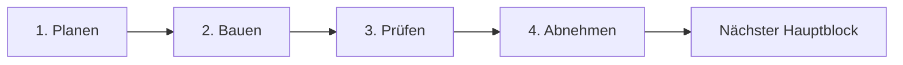

# Idle Tamer – Roadmap A: Systemfundament

- Stand: 22. Juli 2026
- Aktiver Block: **Block 8 – Fundament einfrieren und an Roadmap B übergeben**
- Aktiver Schritt: **Schritt 1 – Planen**
- Visuelle Statusseite: `/roadmap/`
- Statusdaten: `apps/web/public/roadmap/roadmap-status.json`

## Version-0.2-Stabilisierung

Vor Block 4 wurde ein Qualitätscheckpoint eingeschoben: Die Kampfszene lädt nicht mehr fortlaufend ihren vollständigen DOM neu, Erstklicks sind stabil, frische Accounts starten nach der Starterwahl direkt im Kampf und der reale Zonenpfad reicht nun bis Zone 10. Lokale QA-Presets beschleunigen die Abnahme, sind im Produktionsbuild aber deaktiviert. Details: `VERSION_0_2_STABILIZATION.md`.

Die bestätigte Content-Richtung umfasst 40 sammelbare Rookie-Linien: zehn vorhandene plus die 30 derzeitigen Normalgegner-Designs. Die fünf Bosse bleiben separat. Diese Migration wird vor dem serverautoritativen Besitz- und Eiermodell eingeplant.

Die acht Blöcke bilden **Roadmap A – Systemfundament**. Danach folgen Roadmap B für Design und UI, Roadmap C für Content und Features sowie Roadmap D für Abnahme und Prüfung. Erst nach vollständiger Roadmap D beginnt die geschlossene Alpha-Testgruppe. Die Prozentanzeige bezieht sich ausschließlich auf die 32 Gates von Roadmap A. Details: `RELEASE_LIFECYCLE.md`; der vorbereitete Arbeitsrahmen für die nächste Phase steht in `ROADMAP_B_DESIGN_UI.md`.

## Arbeitsmodell: 8 Blöcke × 4 Schritte

Idle Tamer wird in acht aufeinander aufbauenden Hauptblöcken entwickelt. Jeder Block durchläuft immer dieselben vier Arbeitsgates:

1. **Planen** – Regeln, Daten, Oberfläche und Abnahmekriterien festlegen.
2. **Bauen** – den Block als vollständige, nutzbare Funktion implementieren.
3. **Prüfen** – automatisierte Tests, Missbrauchsfälle, Geräte und Migrationen prüfen.
4. **Abnehmen** – Ergebnis im echten Ablauf testen, dokumentieren, committen und freigeben.

Die vier Schritte sind keine gleich langen Zeitabschnitte. Sie sind Qualitätsgates. Ein Bauschritt kann deutlich größer sein als die Planung; abgehakt wird erst, wenn seine Definition of Done erfüllt ist.

## Fortschrittsübersicht

| Block | Ergebnis | 1 Planen | 2 Bauen | 3 Prüfen | 4 Abnehmen | Status |
| --- | --- | :---: | :---: | :---: | :---: | --- |
| 1 | Lokale spielbare Grundversion | [x] | [x] | [x] | [x] | **Fertig** |
| 2 | Backend-bereiter, abgenommener Client | [x] | [x] | [x] | [x] | **Fertig** |
| 3 | API- und PostgreSQL-Fundament | [x] | [x] | [x] | [x] | **Fertig** |
| 4 | Accounts, Sessions und Bootstrap | [x] | [x] | [x] | [x] | **Fertig** |
| 5 | Serverautoritärer Run und Wirtschaft | [x] | [x] | [x] | [x] | **Fertig** |
| 6 | Sammlung, Dauerfortschritt und Zeitjobs online | [x] | [x] | [x] | [x] | **Fertig** |
| 7 | Gilden, Gilden-DNA und soziale Systeme | [x] | [x] | [x] | [x] | **Fertig** |
| 8 | Fundament einfrieren und an Roadmap B übergeben | [ ] | [ ] | [ ] | [ ] | **Aktiv · Planung** |

Gesamtfortschritt: **28 von 32 Schritten abgeschlossen (87,5 %)**.

## Verbindliche Arbeitsregeln

- Es ist immer nur ein Hauptblock aktiv.
- Innerhalb des aktiven Blocks wird Planen → Bauen → Prüfen → Abnehmen eingehalten.
- Unteraufgaben dürfen parallel bearbeitet werden, solange sie dasselbe aktive Gate unterstützen.
- Neue Ideen werden dem passenden späteren Block zugeordnet und unterbrechen den aktiven Block nicht.
- Kritische Bugs dürfen sofort behoben werden; neue Großfunktionen nicht.
- Ein Schritt wird nur abgehakt, wenn Code, Tests und Dokumentation denselben Stand beschreiben.
- Nach jeder Abnahme ist der Git-Arbeitsbaum sauber und der geprüfte Stand auf GitHub gesichert.
- Wenn ein Block zu groß wird, werden seine Unteraufgaben feiner geteilt; die acht Hauptblöcke bleiben stabil.

---

## Block 1 – Lokale spielbare Grundversion

**Ergebnis:** Ein verständliches, testbares Solo-Spiel mit vollständigem Kernloop und ohne vorgetäuschte Online-Funktionen.

### Schritt 1 – Planen ✅

- [x] Spielziel, Kernloop und Prestige-Grenzen festgelegt
- [x] zehn Starterlinien, 30 Gegner, fünf Bosse und drei Zonen geplant
- [x] Gold-, Ei-, Fragment-, Gem- und Forschungsökonomie beschrieben
- [x] Silber-Violett-UI und HD-200×200-Assetstil festgelegt

### Schritt 2 – Bauen ✅

- [x] Login-Vorschau, Offline-Bericht und Starterwahl
- [x] automatischer 1-gegen-1-Kampf, Teamwahl und Zonenboni
- [x] Run-Level, Kampfspeicher, Eier, Brut und Fragmentkreislauf
- [x] Hyperlevel, Evolution, Gems, Forschung und Prestige
- [x] Ziele, Erfolge, Expeditionen, Herstellung, Story und Systempost
- [x] Avatare, Rahmen, Einstellungen sowie Desktop- und Mobiloberfläche

### Schritt 3 – Prüfen ✅

- [x] 30 automatisierte Regel-, Wirtschafts-, API- und Migrationstests
- [x] Offline-Grenze, Reload-Schutz und Einmal-Claims geprüft
- [x] Produktionsbuild erfolgreich
- [x] zehn Monster, 30 Gegner, fünf Bosse, drei Zonen und 45 Gems validiert

### Schritt 4 – Abnehmen ✅

- [x] Pre-Backend-Abnahme dokumentiert
- [x] vollständiger Quellcode samt Runtime-Assets und HD-Mastern strukturiert
- [x] Git-Ausgangsstand ohne Secrets oder große Einzeldateien geprüft
- [x] geprüfte Grundversion auf GitHub gesichert

**Gate erfüllt:** Block 1 ist abgeschlossen und wird nur noch für Fehlerkorrekturen geöffnet.

---

## Block 2 – Backend-bereiter Client

**Ergebnis:** Die sichtbare Grundversion und ihre Regeln sind abgenommen. Der Browser kann später vom lokalen Service auf die HTTP-API wechseln, ohne dass die UI neu gebaut werden muss.

### Schritt 1 – Planen ✅

- [x] ersten Spielbogen für Stunde 1, Tag 1 und Woche 1 verbindlich festlegen
- [x] Kostenkurven für Run-Level, Hyperlevel, Evolution und Forschung abnehmen
- [x] Dropchancen, Pity, Brutzeiten, Fragmente und Prestige-Ertrag einfrieren
- [x] sämtliche Resetgrenzen in einer einzigen Regeltabelle zusammenführen
- [x] vollständigen Spielerablauf Login → Offline → Kampf → Brut → Prestige als Abnahmefall schreiben
- [x] Lade-, Fehler-, Konflikt-, Leer-, Voll- und Maximalzustände je Szene erfassen

**Definition of Done:** Es gibt keine ungeklärte Spielregel, die während des Backendbaus Tabellen oder API-Kommandos verändern würde.

Abgenommen in `GAMEPLAY_FOUNDATION_SPEC.md`: Zielkorridore, Foundation-1.0-Werte, Umsetzungsdeltas, vollständige Prestige-Matrix, 24-Schritte-E2E-Ablauf und UI-Zustandsinventar.

### Schritt 2 – Bauen ✅

- [x] Browser-E2E-Test für den vollständigen Spielerablauf eingebaut
- [x] gemeinsame asynchrone Intent-Schnittstelle für lokalen und HTTP-Spielservice festgezogen
- [x] Offline-Regel, Uhr und Speicherung von DOM, Browserzeit und `localStorage` entkoppelt
- [x] Content-, API-, Fehlercode- und Asset-Verträge eindeutig versioniert
- [x] einheitliche Verbindungs-, Lade- und Revisionskonflikt-UI umgesetzt
- [x] Asset-Manifest und PixelLab-Animationsvertrag für 200×200-Monster ergänzt

**Definition of Done erfüllt:** Foundation-1.0-Werte sind aktiv, 96 Runtime-Bilder besitzen eindeutige IDs und Prüfsummen, und der Browserpfad Login → Offline → Kampf → Brut → Fragmente → Hyperlevel → Evolution → Gem → Prestige läuft automatisiert durch.

### Schritt 3 – Prüfen ✅

- [x] vollständigen Ablauf auf Desktop, Tablet und 390×844 prüfen
- [x] Tastaturbedienung, Kontrast und reduzierte Bewegung testen
- [x] Vertragsprüfungen für lokalen und späteren HTTP-Service ausführen
- [x] Content-IDs, Asset-IDs, Abmessungen und Dateigrößen automatisiert validieren
- [x] Parallel-Tab-, Reload- und veraltete-Revision-Fälle simulieren
- [x] CI für Test, Build, Content und Assets aktivieren

**Definition of Done erfüllt:** Nach dem Version-0.2-Stabilisierungscheckpoint sind 48 Regel-, Content- und Service-Vertragstests sowie zwölf echte Chromium-Abläufe grün. Desktop, Tablet und 390×844 bleiben ohne horizontales Überlaufen bedienbar; Fokusfang, AA-Kontrast, Reduced Motion, Reload-Schutz, veraltete Revisionen, parallele Tabs, DOM-stabile Kampfsteuerung und die Zone-10-Prestigesperre sind automatisiert abgesichert. Die GitHub-CI prüft Tests, Build, Roadmap, alle Assetverträge und den sichtbaren Kernloop.

### Schritt 4 – Abnehmen ✅

- [x] manuellen ersten Spielbogen ohne Blocker abschließen
- [x] automatischen E2E-Kernloop erfolgreich ausführen
- [x] Balance- und Resetregeln als verbindlich markieren
- [x] Backend-API-Vertrag versionieren und freigeben
- [x] Dokumentation, Tests und GitHub-Stand synchronisieren

**Gate erfüllt:** Der erste Spielbogen wurde im echten Browser auf Desktop und 390×844 ohne Blocker abgenommen. `API_CONTRACT_V8.md` friert die Backendgrenze ein: Kein Spielkommando akzeptiert resultierende Bestände vom Client; die UI kennt ausschließlich Absichten und autoritative Antworten. Die vollständige Qualitätsschranke und der GitHub-Stand sind synchron.

---

## Block 3 – API- und PostgreSQL-Fundament

**Ergebnis:** Ein deploybares technisches Backend mit echter PostgreSQL-Datenbank, Migrationen, Logs und sicheren Transaktionsmustern.

### Schritt 1 – Planen ✅

- [x] Zielstruktur für `apps/web`, `apps/api` und gemeinsame Pakete festlegen
- [x] Node/TypeScript-API, PostgreSQL-Zugriff und Migrationstechnik auswählen
- [x] Tabellen, Schlüssel, Indizes, Revisionen und Ledger gegen den Blueprint prüfen
- [x] Entwicklungs-, Test- und Produktionsumgebungen definieren
- [x] Backup-, Wiederherstellungs- und Rollbackstrategie beschreiben

**Gate erfüllt:** `docs/backend` friert Node 24 LTS, Fastify 5, PostgreSQL 18, `pg`, `node-pg-migrate`, den inkrementellen Workspace-Umzug, kanonische SQL-Namen, Revisions-/Idempotenzmuster, Umgebungen sowie Backup und Restore ein. PostgreSQL bleibt die verbindliche Wahrheitsquelle; kritische Regeln existieren nicht nur in TypeScript.

### Schritt 2 – Bauen ✅

- [x] Workspace in Web-, API-, Vertrags-, Content- und Datenbankpakete gliedern
- [x] lokale PostgreSQL-Instanz und isolierte Testdatenbank bereitstellen
- [x] erste versionierte Migrationen und Seed-Daten erstellen
- [x] Healthcheck, strukturierte Logs, Request-ID und einheitliche Fehlerantworten
- [x] Transaktionshelfer für `commandId`, `expectedRevision` und Ledger einbauen
- [x] Content-Version und Feature-Flag-Grundlage speichern

**Gate erfüllt:** Fastify und PostgreSQL 18 sind als reproduzierbarer Workspace-Unterbau vorhanden. GitHub Actions hat Migration, echte SQL-Constraints, parallele Idempotenz, Revision, Ledger, Builds, Assets und Browserpfade erfolgreich ausgeführt.

### Schritt 3 – Prüfen ✅

- [x] Migration von leerer Datenbank bis aktuellem Schema testen
- [x] echte PostgreSQL-Integrationstests ausführen
- [x] negative Bestände per `CHECK` und bedingter Aktualisierung verhindern
- [x] parallele Kommandos, Rollback und wiederholte Requests testen
- [x] Backup in eine leere Datenbank zurückspielen
- [x] Logs und Fehler enthalten keine Passwörter, Cookies oder privaten Daten

**Gate erfüllt:** PostgreSQL 18 migriert in CI vorwärts, rückwärts und erneut vorwärts. Vier echte Integrationstests beweisen Constraints, parallele Idempotenz, Konflikte und vollständigen Rollback. Ein Custom-Format-Dump wird in eine neue Datenbank restauriert und dort durch Healthcheck, Beispielbuchung, Revision und Ledger geprüft. Der reale JSON-Logger redigiert Auth-Header, Cookies, Token, Passwörter und E-Mail-Felder.

### Schritt 4 – Abnehmen ✅

- [x] API und Datenbank reproduzierbar auf dem Entwicklungsserver starten
- [x] Testumgebung automatisch aufbauen und migrieren
- [x] Healthcheck, Seed, Transaktionsmuster und Ledger im echten Lauf prüfen
- [x] Architektur- und Betriebsdokumentation aktualisieren
- [x] geprüften Fundamentstand sichern

**Gate erfüllt:** Ubuntu 26.04 startet Docker Engine und PostgreSQL 18 nach einem echten Serverneustart automatisch. Migration, Seed, acht Fundamenttabellen, aktiver Content-Release, internes Datenbank-Binding, SSH-Schlüsselzugang, Firewall, täglicher Backup-Timer und ein lesbarer Initial-Dump wurden geprüft. CI beweist ergänzend Idempotenz, Revision, Ledger, Rollback und Restore. Der Server kann noch wenig Spielinhalt, aber jede vorhandene Schreibaktion ist bereits atomar, idempotent und beobachtbar.

---

## Block 4 – Accounts, Sessions und Bootstrap

**Ergebnis:** Ein Spieler kann einen echten Account erstellen, sich sicher anmelden und dasselbe serverautoritative Profil samt Starterwahl auf einem zweiten Browser laden. Die übrigen Spielbereiche werden erst in ihren eigenen Blöcken online autoritativ.

### Schritt 1 – Planen ✅

- [x] Registrierungs-, Login-, Logout- und Wiederherstellungsablauf festlegen
- [x] Sessiondauer, Geräteverwaltung und Widerruf definieren
- [x] Spielername, Avatar, Rahmen und Accountstatus modellieren
- [x] Bootstrap-DTO und Fehlerzustände festziehen
- [x] Datenschutz-, Export- und Löschanforderungen dokumentieren

**Gate erfüllt:** `backend/BLOCK4_AUTH_PLAN.md` legt Accountzustände, Argon2id, Cookie- und CSRF-Regeln, konkrete Sessionfristen, Gerätewiderruf, Enumeration- und Rate-Limit-Schutz, Recovery, Rollen, Profil, Starterwahl, Export und Löschung fest. `backend/AUTH_API_CONTRACT.md` definiert Auth-Vertrag 1 und `backend/AUTH_SCHEMA_PLAN.md` die additive Migration 000002. Block 4 synchronisiert bewusst nur Account, Profil und Starter; die UI kennzeichnet den übrigen Spielstand bis Block 5 und 6 weiterhin als lokal.

### Schritt 2 – Bauen ✅

- [x] Benutzer, Zugangsdaten, Sessions und Profile implementieren
- [x] sichere Passwort-Hashes und HTTP-only Session-Cookies verwenden
- [x] Registrierung, E-Mailbestätigung, Login, Logout, Recovery und Sessionwiderruf umsetzen
- [x] `GET /api/v1/bootstrap` als ehrlichen Account-Bootstrap mit Autoritätsmatrix bauen
- [x] Starterwahl als erstes echtes idempotentes Spielkommando migrieren
- [x] Rollenbasis für Spieler, Support, Moderator und Admin einführen
- [x] Export- und Löschanforderung samt Retentionjob umsetzen
- [x] Account-Client anbinden und lokale Saves strikt nach Account-Namespace trennen

**Definition of Done erfüllt:** Migration `000002_accounts_and_sessions`, Argon2id, gehashte Session-/CSRF-Token, PostgreSQL-Rate-Limits, Mailport, Recovery, Gerätewiderruf, Rollen, Profilkosmetik, idempotente Starterwahl, Exportanforderung und siebentägige Löschfrist sind implementiert. Der Browser nutzt echte Accounts, zeigt die begrenzte Autorität offen an und öffnet lokale Spielstände ausschließlich im serverseitig zugewiesenen Account-Namespace. Details: `backend/AUTH_IMPLEMENTATION.md`.

### Schritt 3 – Prüfen ✅

- [x] Brute-Force-, Rate-Limit- und Session-Fixation-Fälle testen
- [x] abgelaufene, widerrufene und parallele Sessions prüfen
- [x] Account auf zweitem Browser laden und Zustand vergleichen
- [x] doppelte Namen, ungültige Eingaben und gesperrte Accounts testen
- [x] Cookies, CORS, CSRF-Schutz und Produktionskonfiguration prüfen

**Definition of Done erfüllt:** 73 Unit- und Vertragstests, 14 isolierte PostgreSQL-Integrationsfälle, zwölf reguläre Chromium-Abläufe und ein zusätzlicher Live-Ablauf mit zwei getrennten Browserkontexten sind grün. Geprüft sind unter anderem Login- und Reset-Limits, progressive Fehlversuchsverzögerung, CSRF-Rotation, Session-Fixation, Ablauf und Widerruf, gesperrte Accounts, doppelte Namen, Produktions-Cookies und derselbe Starter samt Account-Namespace auf Browser A und B. Der Live-Test deckte außerdem eine falsche Browser-`fetch`-Bindung auf; der behobene Client läuft jetzt über den echten HTTPS-Proxy. Details: `backend/AUTH_SECURITY_VERIFICATION.md`.

### Schritt 4 – Abnehmen ✅

- [x] neuer Account erreicht sicher die Starterwahl
- [x] erneuter Login liefert exakt dasselbe Accountprofil und dieselbe Starterwahl
- [x] Logout und Widerruf beenden die Session zuverlässig
- [x] Support kann Accountstatus nachvollziehen, aber keine Werte heimlich verändern
- [x] Authentifizierungsablauf dokumentieren und freigeben

**Definition of Done erfüllt:** Ein echter Entwickleraccount wurde registriert, über die private Entwicklungs-Mailbox bestätigt und erfolgreich eingeloggt. Ein separater synthetischer Live-Account durchlief Registrierung, Verifikation, Starterwahl, denselben Zustand in zwei Browsern, Fremdsitzungswiderruf, Löschvormerkung, Löschabbruch und Logout; Account und Mailboxeintrag wurden danach vollständig entfernt. Die serverinterne Supportsicht läuft in einer technisch erzwungenen PostgreSQL-`READ ONLY`-Transaktion, maskiert die E-Mail und gibt weder Credentials noch Token-, Cookie- oder CSRF-Material aus. Block 4 ist für den internen Entwicklungsbetrieb freigegeben. Externer Mailversand samt SPF, DKIM und DMARC bleibt ein Gate vor der Alpha nach Roadmap D. Details: `backend/AUTH_ACCEPTANCE.md`.

**Gate erfüllt:** Identität und Basiszustand funktionieren online. Besitz- und Wirtschaftsaktionen folgen in Block 5 und 6.

---

## Block 5 – Serverautoritärer Run und Wirtschaft

**Ergebnis:** Kampf, Gold, Level, Zonen und Kampfspeicher werden ausschließlich vom Server berechnet und in PostgreSQL gespeichert.

### Schritt 1 – Planen ✅

- [x] serverseitiges Kampftick- und Zeitstempelmodell festlegen
- [x] Run-, Level-, Zonen- und Kampfspeichertabellen finalisieren
- [x] Reward-Batches und atomaren Sammelablauf definieren
- [x] große Zahlen und API-Stringtransport verbindlich festlegen
- [x] Cheating- und Parallel-Request-Fälle als Testspezifikation schreiben

**Gate erfüllt:** `backend/BLOCK5_RUN_PLAN.md` legt Serverzeit, deterministische Kampfabrechnung, den 90-Plätze-Speicher, exakte Reward-Batches, Run-Revisionen und die Block-6-Grenze fest. `backend/RUN_API_CONTRACT.md` friert Run-Vertrag 1 ein.

### Schritt 2 – Bauen ✅

- [x] aktives Run-Monster, Zone, Stage und Freischaltungen migrieren
- [x] serverseitige Kampfbewertung und Belohnungserzeugung bauen
- [x] Kampfspeicher mit serverseitigen Reward-Batches umsetzen
- [x] Gold, Run-Level und Upgrade-Kosten serverautoritativ machen
- [x] Sammeln, Leveln und Zonenwahl als Transaktionskommandos migrieren
- [x] Kampfszene und Monsteransicht auf den Run-API-Vertrag umschalten

**Gate erfüllt:** Migration `000003_authoritative_run`, Run-Store und Fastify-Routen speichern den sichtbaren Run in PostgreSQL. Der Browser sendet nur Absichten und übernimmt den vollständigen autoritativen Snapshot; lokale Systeme dürfen kein Online-Gold mehr verändern. Details stehen in `backend/RUN_IMPLEMENTATION.md`.

### Schritt 3 – Prüfen ✅

- [x] Client darf keine Siege, Kampfzeit oder resultierenden Bestände festlegen
- [x] wiederholtes Sammeln und parallele Kommandos zahlen nicht doppelt
- [x] negative Goldbestände, falsche Monster und gesperrte Zonen verhindern
- [x] lange Laufzeiten, 50- bis 70-stellige Zahlen und Migrations-Rollback simulieren
- [x] kompletter Account-, Starter-, Run-Level- und Zweitbrowserpfad live prüfen

**Gate erfüllt:** 87 lokale Tests, 22 echte PostgreSQL-Fälle, zwölf reguläre Chromium-Abläufe und ein zusätzlicher Live-Zweitbrowserlauf sind grün. Die Produktionsroute verwirft manipulierte Gold-/Siegfelder, begrenzt Nachholung auf 90 Kämpfe und bucht Claims exakt einmal. Nachweise: `backend/RUN_SECURITY_VERIFICATION.md`.

### Schritt 4 – Abnehmen ✅

- [x] Kampf läuft nach Reload und auf zweitem Gerät korrekt weiter
- [x] Gold, Level, Stage und Speicher stimmen zwischen UI und Ledger überein
- [x] absichtlich veralteter Client erhält einen lösbaren Revisionskonflikt
- [x] lokaler Save ist für Run-Werte nicht mehr autoritativ
- [x] Wirtschaftsmetriken und Supportansicht sind verfügbar

**Gate erfüllt:** Run-Vertrag 2 und die Block-6-Migration haben die letzte lokale Wirtschaftsgrenze entfernt. Reload, Revisionskonflikt, PostgreSQL-Ledger und Zweitbrowserpfad wurden geprüft.

---

## Block 6 – Sammlung, Dauerfortschritt und Zeitjobs

**Ergebnis:** Alle übrigen Solo-Systeme liegen autoritativ auf dem Server. Damit ist das Solo-Systemfundament von Roadmap A spielmechanisch vollständig.

### Schritt 1 – Planen ✅

- [x] Tabellen und Kommandos für Eier, Monster, Fragmente, Gems und Forschung finalisieren
- [x] Zeitjobmodell für Brut, Expeditionen und Offline-Ertrag vereinheitlichen
- [x] Prestige-Transaktion samt Reset- und Erhalteliste festschreiben
- [x] Ziele, Story, Herstellung, Kosmetik und Systempost als Claims modellieren
- [x] Content-Veröffentlichung und Admin-Berechtigungen festlegen

### Schritt 2 – Bauen ✅

- [x] Eierdrops, Pity, Inkubation, Erstfund und Duplikat-Fragmente migrieren
- [x] Hyperlevel, Evolution, Gems, Forschung und Prestige migrieren
- [x] Tages-/Wochenziele, Erfolge, Expeditionen und Herstellung migrieren
- [x] Story-, Avatar-, Rahmen- und Systempost-Claims migrieren
- [x] Offline-Ertrag aus Serverzeit und gültiger Content-Version berechnen
- [x] geschützte Content-, Support- und Admin-Grundwerkzeuge bauen

### Schritt 3 – Prüfen ✅

- [x] Zeitmanipulation, Parallel-Tabs und Request-Retries abfangen
- [x] vollständigen Prestige-Erhalt permanenter Werte prüfen
- [x] doppelte Claims, doppelte Brut und mehrfach eingesetzte Monster verhindern
- [x] Quellen und Senken jeder Währung über das Ledger bilanzieren
- [x] Content-Vorschau, Aktivierung und Rollback testen
- [x] vollständigen Online-E2E-Kernloop ausführen

### Schritt 4 – Abnehmen ✅

- [x] alle wertrelevanten Funktionen aus Block 1 arbeiten über den HTTP-/Run-Service
- [x] `localStorage` enthält nur noch Komfortdaten
- [x] Offline-Bericht ist serverseitig und einmalig claimbar
- [x] Support- und Admin-Aktionen sind berechtigt und protokolliert
- [x] Solo-Online-Entwicklungsstand mit Backup- und Wiederherstellungsprobe freigeben

**Gate erfüllt:** Die komplette Solo-Version ist online. Nachweise: `backend/BLOCK6_SOLO_ONLINE_ACCEPTANCE.md`.

---

## Block 7 – Gilden, Gilden-DNA und soziale Systeme

**Ergebnis:** Spieler können sich dauerhaft organisieren, gemeinsam investieren und kooperative Inhalte bestreiten.

### Schritt 1 – Planen ✅

- [x] Gildengründung, Mitgliedschaft, Rollen und Wechselregeln finalisieren
- [x] DNA-Ressource, Chromosomen, Gene, Kostenkurven und Power-Grenzen festlegen
- [x] Investitionsrechte und Abstimmungsmodell auswählen
- [x] Gildenboss, Aufgaben, Spenden und Expeditionen spezifizieren
- [x] Chat-, Freundes-, Blockier- und Moderationsregeln definieren

### Schritt 2 – Bauen ✅

- [x] Gilden erstellen, suchen, beitreten, verlassen und verwalten
- [x] Rollen, Einladungen, Limits, Spenden und Gilden-Ledger umsetzen
- [x] Gilden-DNA mit Chromosomen, Genstufen und passiven Boni bauen
- [x] animierte Doppelhelix und sichtbare Mutationen integrieren
- [x] Gildenaufgaben, Gildenboss und gemeinsame Expeditionen umsetzen
- [x] Freunde, Gildenchat, Blockieren und Meldungen ergänzen

### Schritt 3 – Prüfen ✅

- [x] Berechtigungen jeder Gildenrolle und jedes DNA-Kommandos testen
- [x] Doppelausgaben, Gildenwechsel und Belohnungs-Hopping verhindern
- [x] kleine und große Gilden in Simulationen vergleichen
- [x] DNA-Power-Creep und spätere Komfortgene prüfen
- [x] Chatfilter, Blockieren, Meldungen und Moderationsaudit testen
- [x] Gildenboss unter paralleler Last prüfen

### Schritt 4 – Abnehmen ✅

- [x] Gilde kann den vollständigen gemeinsamen Wochenloop spielen
- [x] jede Spende und DNA-Ausgabe ist im Ledger nachvollziehbar
- [x] Wechsel- und Belohnungsregeln sind für Spieler sichtbar
- [x] Moderation kann Missbrauch bearbeiten, ohne Wirtschaftsdaten zu verdecken
- [x] Gildensystem für die geschlossene Online-Testgruppe freigeben

**Gate erfüllt:** Der kooperative Mehrspielerloop funktioniert fair, nachvollziehbar und moderierbar. Nachweise: `backend/BLOCK7_GUILD_SOCIAL_ACCEPTANCE.md`.

---

## Block 8 – Fundament einfrieren und an Roadmap B übergeben

**Ergebnis:** Roadmap A endet als sauber dokumentiertes und reproduzierbares Systemfundament. Roadmap B kann die gesamte Oberfläche neu ordnen und gestalten, ohne dabei Spiellogik, Datenautorität oder Betriebswissen erraten zu müssen.

### Schritt 1 – Planen ⬜

- [ ] verbindliche Grenze zwischen Roadmap A und B festlegen
- [ ] alle vorhandenen Ansichten, Dialoge, HUDs und Zustände inventarisieren
- [ ] technische Verträge markieren, die Roadmap B nicht brechen darf
- [ ] bekannte UX-Schulden ohne vorschnelle Designlösung sammeln
- [ ] Roadmap-B-Arbeitsblöcke für Interface, Lesbarkeit, Profile und Responsive Design formulieren
- [ ] PvP, Handel, Events und weitere große Features eindeutig Roadmap C zuordnen

### Schritt 2 – Bauen ⬜

- [ ] zentralen UI-Bauteil- und Zustandskatalog anlegen
- [ ] Screenshot- und Viewport-Abnahmewerkzeuge für Roadmap B vorbereiten
- [ ] Profilbild-, Avatar- und Rahmendatenvertrag dokumentieren
- [ ] Design-Tokens, Assetquellen und PixelLab-Übergaben zentral erfassbar machen
- [ ] veraltete oder doppelte Entwicklungsdokumente bereinigen
- [ ] Roadmap-A-Übergabepaket als schnellen Einstiegspunkt fertigstellen

### Schritt 3 – Prüfen ⬜

- [ ] vollständigen lokalen Gesamtcheck und PostgreSQL-18-Integrationen ausführen
- [ ] Dev-Domain, Accounts, Run, Sammlung und Gilden im Browser erneut rauchtesten
- [ ] Backup, Migrationen, Restore-Anleitung und Serverneustart prüfen
- [ ] Roadmap-, Vertrags- und Versionsangaben auf Widersprüche prüfen
- [ ] sicherstellen, dass Roadmap B keine wertrelevante Logik in den Browser verschiebt
- [ ] Repository und Servercheckout auf denselben sauberen Commit bringen

### Schritt 4 – Abnehmen ⬜

- [ ] Roadmap-A-Abschlussbericht mit offenen UX-Themen veröffentlichen
- [ ] Systemfundament gegen die ursprünglichen acht Blöcke abnehmen
- [ ] Roadmap A einfrieren und nur noch für kritische Fehler öffnen
- [ ] Roadmap B als aktiven Design- und UI-Zyklus starten
- [ ] öffentliche Statusseite von A.08 auf B.01 umstellen
- [ ] ausdrücklich festhalten, dass noch keine Alpha-Testgruppe startet

**Gate:** Das Systemfundament ist übergabefähig. Roadmap B beginnt mit Design, Interface, UI, Lesbarkeit, Profilbildern, Avataren und Rahmen. Die Alpha bleibt bis zum Abschluss von Roadmap D geschlossen.

---

## Verbindliche technische Entscheidungen

- **Datenbank:** PostgreSQL für Accounts, Besitz, Zeitjobs, Gilden und Transaktionen.
- **Serverautorität:** Der Browser übermittelt Absichten, niemals resultierende Bestände.
- **Transaktionen:** Jeder wertverändernde Befehl ist atomar und idempotent.
- **Revisionen:** `expectedRevision` verhindert das Überschreiben neuerer Zustände.
- **Zeit:** Ausschließlich Serverzeit in UTC, gespeichert als `timestamptz`.
- **Große Zahlen:** SQL `numeric`, Transport als String, keine Gleitkomma-Währungen.
- **Content:** Definitionen bleiben versioniert; SQL speichert IDs und aktive Versionen.
- **Sessions:** Sichere HTTP-only Cookies statt Besitz-Tokens in `localStorage`.
- **Audit:** Kritische Wirtschafts-, Gilden- und Admin-Aktionen erhalten ein Ledger.

## Was bewusst nicht vorgezogen wird

- keine lokal vorgetäuschten Gilden, Ranglisten oder Spielerchats
- kein Handel, bevor Besitz und Ledger serverautoritativ sind
- kein sekündliches Speichern des Idle-Kampfs in PostgreSQL
- kein unversioniertes Direkteditieren von Produktions-Content
- keine neue Großfunktion zwischen Block 2 und der Solo-Backendmigration
- keine Echtgeldfunktion ohne gesonderte rechtliche und technische Planung

## Direkt als Nächstes

**Block A.08 beginnt mit dem Übergabeplan an Roadmap B.** Der technische Stand wird eingefroren, alle sichtbaren Oberflächen und Zustände werden inventarisiert und die UX-Schulden werden gesammelt. Danach startet Roadmap B mit dem vollständigen Design- und UI-Zyklus.

PvP, Handel, Saisons, Events und weitere große Features gehören in Roadmap C. Reale Alpha-Spielerdaten werden erst nach der vollständigen Abnahme in Roadmap D erhoben.

Der technische Wiedereinstieg und die Block-6-/7-Nachweise stehen in `CURRENT_CHECKPOINT.md`, `backend/BLOCK6_SOLO_ONLINE_ACCEPTANCE.md` und `backend/BLOCK7_GUILD_SOCIAL_ACCEPTANCE.md`.
