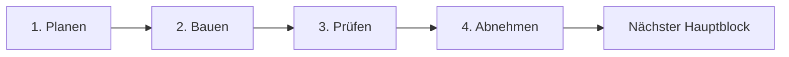

# Idle Tamer – Arbeitsroadmap

- Stand: 20. Juli 2026
- Aktiver Block: **Block 2 – Backend-bereiter Client**
- Aktiver Schritt: **Schritt 1 – Planen**
- Visuelle Statusseite: `/roadmap/`
- Statusdaten: `public/roadmap/roadmap-status.json`

## Arbeitsmodell: 8 Blöcke × 4 Schritte

Idle Tamer wird in acht aufeinander aufbauenden Hauptblöcken entwickelt. Jeder Block durchläuft immer dieselben vier Arbeitsgates:

1. **Planen** – Regeln, Daten, Oberfläche und Abnahmekriterien festlegen.
2. **Bauen** – den Block als vollständige, nutzbare Funktion implementieren.
3. **Prüfen** – automatisierte Tests, Missbrauchsfälle, Geräte und Migrationen prüfen.
4. **Abnehmen** – Ergebnis im echten Ablauf testen, dokumentieren, committen und freigeben.

Die vier Schritte sind keine gleich langen Zeitabschnitte. Sie sind Qualitätsgates. Ein Bauschritt kann deutlich größer sein als die Planung; abgehakt wird erst, wenn seine Definition of Done erfüllt ist.

## Fortschrittsübersicht

| Block | Ergebnis | 1 Planen | 2 Bauen | 3 Prüfen | 4 Abnehmen | Status |
| --- | --- | :---: | :---: | :---: | :---: | --- |
| 1 | Lokale spielbare Grundversion | [x] | [x] | [x] | [x] | **Fertig** |
| 2 | Backend-bereiter, abgenommener Client | [ ] | [ ] | [ ] | [ ] | **Aktiv** |
| 3 | API- und PostgreSQL-Fundament | [ ] | [ ] | [ ] | [ ] | Geplant |
| 4 | Accounts, Sessions und Bootstrap | [ ] | [ ] | [ ] | [ ] | Geplant |
| 5 | Serverautoritärer Run und Wirtschaft | [ ] | [ ] | [ ] | [ ] | Geplant |
| 6 | Sammlung, Dauerfortschritt und Zeitjobs online | [ ] | [ ] | [ ] | [ ] | Geplant |
| 7 | Gilden, Gilden-DNA und soziale Systeme | [ ] | [ ] | [ ] | [ ] | Geplant |
| 8 | PvP, Handel, Live Ops und Launch | [ ] | [ ] | [ ] | [ ] | Geplant |

Gesamtfortschritt: **4 von 32 Schritten abgeschlossen**.

## Verbindliche Arbeitsregeln

- Es ist immer nur ein Hauptblock aktiv.
- Innerhalb des aktiven Blocks wird Planen → Bauen → Prüfen → Abnehmen eingehalten.
- Unteraufgaben dürfen parallel bearbeitet werden, solange sie dasselbe aktive Gate unterstützen.
- Neue Ideen werden dem passenden späteren Block zugeordnet und unterbrechen den aktiven Block nicht.
- Kritische Bugs dürfen sofort behoben werden; neue Großfunktionen nicht.
- Ein Schritt wird nur abgehakt, wenn Code, Tests und Dokumentation denselben Stand beschreiben.
- Nach jeder Abnahme ist der Git-Arbeitsbaum sauber und der geprüfte Stand auf GitHub gesichert.
- Wenn ein Block zu groß wird, werden seine Unteraufgaben feiner geteilt; die acht Hauptblöcke bleiben stabil.

---

## Block 1 – Lokale spielbare Grundversion

**Ergebnis:** Ein verständliches, testbares Solo-Spiel mit vollständigem Kernloop und ohne vorgetäuschte Online-Funktionen.

### Schritt 1 – Planen ✅

- [x] Spielziel, Kernloop und Prestige-Grenzen festgelegt
- [x] zehn Starterlinien, 30 Gegner, fünf Bosse und drei Zonen geplant
- [x] Gold-, Ei-, Fragment-, Gem- und Forschungsökonomie beschrieben
- [x] Silber-Violett-UI und HD-200×200-Assetstil festgelegt

### Schritt 2 – Bauen ✅

- [x] Login-Vorschau, Offline-Bericht und Starterwahl
- [x] automatischer 1-gegen-1-Kampf, Teamwahl und Zonenboni
- [x] Run-Level, Kampfspeicher, Eier, Brut und Fragmentkreislauf
- [x] Hyperlevel, Evolution, Gems, Forschung und Prestige
- [x] Ziele, Erfolge, Expeditionen, Herstellung, Story und Systempost
- [x] Avatare, Rahmen, Einstellungen sowie Desktop- und Mobiloberfläche

### Schritt 3 – Prüfen ✅

- [x] 30 automatisierte Regel-, Wirtschafts-, API- und Migrationstests
- [x] Offline-Grenze, Reload-Schutz und Einmal-Claims geprüft
- [x] Produktionsbuild erfolgreich
- [x] zehn Monster, 30 Gegner, fünf Bosse, drei Zonen und 45 Gems validiert

### Schritt 4 – Abnehmen ✅

- [x] Pre-Backend-Abnahme dokumentiert
- [x] vollständiger Quellcode samt Runtime-Assets und HD-Mastern strukturiert
- [x] Git-Ausgangsstand ohne Secrets oder große Einzeldateien geprüft
- [x] geprüfte Grundversion auf GitHub gesichert

**Gate erfüllt:** Block 1 ist abgeschlossen und wird nur noch für Fehlerkorrekturen geöffnet.

---

## Block 2 – Backend-bereiter Client

**Ergebnis:** Die sichtbare Grundversion und ihre Regeln sind abgenommen. Der Browser kann später vom lokalen Service auf die HTTP-API wechseln, ohne dass die UI neu gebaut werden muss.

### Schritt 1 – Planen ⬜

- [ ] ersten Spielbogen für Stunde 1, Tag 1 und Woche 1 verbindlich festlegen
- [ ] Kostenkurven für Run-Level, Hyperlevel, Evolution und Forschung abnehmen
- [ ] Dropchancen, Pity, Brutzeiten, Fragmente und Prestige-Ertrag einfrieren
- [ ] sämtliche Resetgrenzen in einer einzigen Regeltabelle zusammenführen
- [ ] vollständigen Spielerablauf Login → Offline → Kampf → Brut → Prestige als Abnahmefall schreiben
- [ ] Lade-, Fehler-, Konflikt-, Leer-, Voll- und Maximalzustände je Szene erfassen

**Definition of Done:** Es gibt keine ungeklärte Spielregel, die während des Backendbaus Tabellen oder API-Kommandos verändern würde.

### Schritt 2 – Bauen ⬜

- [ ] Browser-E2E-Test für den vollständigen Spielerablauf einbauen
- [ ] gemeinsame Service-Schnittstelle für `LocalGameService` und `HttpGameService` festziehen
- [ ] reine Regeln von DOM, Browserzeit und `localStorage` entkoppeln
- [ ] Content-, API- und Fehlercode-Verträge eindeutig versionieren
- [ ] einheitliche Verbindungs-, Lade- und Revisionskonflikt-UI umsetzen
- [ ] Asset-Manifest und PixelLab-Animationsvertrag für 200×200-Monster ergänzen

### Schritt 3 – Prüfen ⬜

- [ ] vollständigen Ablauf auf Desktop, Tablet und 390×844 prüfen
- [ ] Tastaturbedienung, Kontrast und reduzierte Bewegung testen
- [ ] Vertragsprüfungen für lokalen und späteren HTTP-Service ausführen
- [ ] Content-IDs, Asset-IDs, Abmessungen und Dateigrößen automatisiert validieren
- [ ] Parallel-Tab-, Reload- und veraltete-Revision-Fälle simulieren
- [ ] CI für Test, Build, Content und Assets aktivieren

### Schritt 4 – Abnehmen ⬜

- [ ] manuellen ersten Spielbogen ohne Blocker abschließen
- [ ] automatischen E2E-Kernloop erfolgreich ausführen
- [ ] Balance- und Resetregeln als verbindlich markieren
- [ ] Backend-API-Vertrag versionieren und freigeben
- [ ] Dokumentation, Tests und GitHub-Stand synchronisieren

**Gate:** Kein Spielkommando akzeptiert resultierende Bestände vom Client. Die UI kennt ausschließlich Absichten und autoritative Antworten.

---

## Block 3 – API- und PostgreSQL-Fundament

**Ergebnis:** Ein deploybares technisches Backend mit echter PostgreSQL-Datenbank, Migrationen, Logs und sicheren Transaktionsmustern.

### Schritt 1 – Planen ⬜

- [ ] Zielstruktur für `apps/web`, `apps/api` und gemeinsame Pakete festlegen
- [ ] Node/TypeScript-API, PostgreSQL-Zugriff und Migrationstechnik auswählen
- [ ] Tabellen, Schlüssel, Indizes, Revisionen und Ledger gegen den Blueprint prüfen
- [ ] Entwicklungs-, Test- und Produktionsumgebungen definieren
- [ ] Backup-, Wiederherstellungs- und Rollbackstrategie beschreiben

**Technischer Rat:** Node/TypeScript mit einer kleinen HTTP-Schicht passt zum vorhandenen Client, weil Verträge und Typen geteilt werden können. PostgreSQL bleibt dennoch die verbindliche Wahrheitsquelle; wichtige Regeln dürfen nicht nur in TypeScript existieren.

### Schritt 2 – Bauen ⬜

- [ ] Workspace in Web-, API-, Vertrags-, Content- und Datenbankpakete gliedern
- [ ] lokale PostgreSQL-Instanz und isolierte Testdatenbank bereitstellen
- [ ] erste versionierte Migrationen und Seed-Daten erstellen
- [ ] Healthcheck, strukturierte Logs, Request-ID und einheitliche Fehlerantworten
- [ ] Transaktionshelfer für `commandId`, `expectedRevision` und Ledger einbauen
- [ ] Content-Version und Feature-Flag-Grundlage speichern

### Schritt 3 – Prüfen ⬜

- [ ] Migration von leerer Datenbank bis aktuellem Schema testen
- [ ] echte PostgreSQL-Integrationstests ausführen
- [ ] negative Bestände per `CHECK` und bedingter Aktualisierung verhindern
- [ ] parallele Kommandos, Rollback und wiederholte Requests testen
- [ ] Backup in eine leere Datenbank zurückspielen
- [ ] Logs und Fehler enthalten keine Passwörter, Cookies oder privaten Daten

### Schritt 4 – Abnehmen ⬜

- [ ] API und Datenbank reproduzierbar lokal starten
- [ ] Testumgebung automatisch aufbauen und migrieren
- [ ] Healthcheck, Beispieltransaktion und Ledger im echten Lauf prüfen
- [ ] Architektur- und Betriebsdokumentation aktualisieren
- [ ] geprüften Fundamentstand sichern

**Gate:** Der Server kann noch wenig Spielinhalt, aber jede vorhandene Schreibaktion ist bereits atomar, idempotent und beobachtbar.

---

## Block 4 – Accounts, Sessions und Bootstrap

**Ergebnis:** Ein Spieler kann einen echten Account erstellen, sich sicher anmelden und denselben autoritativen Grundspielstand auf einem zweiten Browser laden.

### Schritt 1 – Planen ⬜

- [ ] Registrierungs-, Login-, Logout- und Wiederherstellungsablauf festlegen
- [ ] Sessiondauer, Geräteverwaltung und Widerruf definieren
- [ ] Spielername, Avatar, Rahmen und Accountstatus modellieren
- [ ] Bootstrap-DTO und Fehlerzustände festziehen
- [ ] Datenschutz-, Export- und Löschanforderungen dokumentieren

### Schritt 2 – Bauen ⬜

- [ ] Benutzer, Zugangsdaten, Sessions und Profile implementieren
- [ ] sichere Passwort-Hashes und HTTP-only Session-Cookies verwenden
- [ ] Registrierung, Login, Logout und Sessionwiderruf umsetzen
- [ ] `GET /api/game/state` als autoritativen Bootstrap bauen
- [ ] Starterwahl als erstes echtes idempotentes Spielkommando migrieren
- [ ] Rollenbasis für Spieler, Support, Moderator und Admin einführen

### Schritt 3 – Prüfen ⬜

- [ ] Brute-Force-, Rate-Limit- und Session-Fixation-Fälle testen
- [ ] abgelaufene, widerrufene und parallele Sessions prüfen
- [ ] Account auf zweitem Browser laden und Zustand vergleichen
- [ ] doppelte Namen, ungültige Eingaben und gesperrte Accounts testen
- [ ] Cookies, CORS, CSRF-Schutz und Produktionskonfiguration prüfen

### Schritt 4 – Abnehmen ⬜

- [ ] neuer Account erreicht sicher die Starterwahl
- [ ] erneuter Login liefert exakt denselben Serverzustand
- [ ] Logout und Widerruf beenden die Session zuverlässig
- [ ] Support kann Accountstatus nachvollziehen, aber keine Werte heimlich verändern
- [ ] Authentifizierungsablauf dokumentieren und freigeben

**Gate:** Identität und Basiszustand funktionieren online. Besitz- und Wirtschaftsaktionen folgen erst in den nächsten Blöcken.

---

## Block 5 – Serverautoritärer Run und Wirtschaft

**Ergebnis:** Kampf, Gold, Level, Zonen und Kampfspeicher werden ausschließlich vom Server berechnet und in PostgreSQL gespeichert.

### Schritt 1 – Planen ⬜

- [ ] serverseitiges Kampftick- und Zeitstempelmodell festlegen
- [ ] Run-, Team-, Zonen- und Kampfspeichertabellen finalisieren
- [ ] Reward-Batches und atomaren Sammelablauf definieren
- [ ] große Zahlen und API-Stringtransport verbindlich festlegen
- [ ] Cheating- und Parallel-Request-Fälle als Testspezifikation schreiben

### Schritt 2 – Bauen ⬜

- [ ] Front, Support, Zone, Stage und Freischaltungen migrieren
- [ ] serverseitige Kampfbewertung und Belohnungserzeugung bauen
- [ ] Kampfspeicher mit serverseitigen Reward-Batches umsetzen
- [ ] Gold, Run-Level und Upgrade-Kosten serverautoritativ machen
- [ ] Sammeln, Leveln und Zonenwahl als Transaktionskommandos migrieren
- [ ] Client für diesen Block auf `HttpGameService` umschalten

### Schritt 3 – Prüfen ⬜

- [ ] Client darf keine Siege, Drops oder resultierenden Bestände festlegen
- [ ] wiederholtes Sammeln und parallele Level-Ups zahlen nicht doppelt
- [ ] negative Goldbestände und ungültige Teamkombinationen verhindern
- [ ] lange Laufzeiten, große Zahlen und Serverneustart simulieren
- [ ] kompletter Run bis zur Prestige-Freischaltung als API-Test

### Schritt 4 – Abnehmen ⬜

- [ ] Kampf läuft nach Reload und auf zweitem Gerät korrekt weiter
- [ ] Gold, Level, Stage und Speicher stimmen zwischen UI und Ledger überein
- [ ] absichtlich veralteter Client erhält einen lösbaren Revisionskonflikt
- [ ] lokaler Save ist für Run-Werte nicht mehr autoritativ
- [ ] Wirtschaftsmetriken und Supportansicht sind verfügbar

**Gate:** Der sichtbare Hauptkampf ist vollständig online und gegen einfache Clientmanipulation abgesichert.

---

## Block 6 – Sammlung, Dauerfortschritt und Zeitjobs

**Ergebnis:** Alle übrigen Solo-Systeme liegen autoritativ auf dem Server. Damit ist die Online-Alpha spielmechanisch vollständig.

### Schritt 1 – Planen ⬜

- [ ] Tabellen und Kommandos für Eier, Monster, Fragmente, Gems und Forschung finalisieren
- [ ] Zeitjobmodell für Brut, Expeditionen und Offline-Ertrag vereinheitlichen
- [ ] Prestige-Transaktion samt Reset- und Erhalteliste festschreiben
- [ ] Ziele, Story, Herstellung, Kosmetik und Systempost als Claims modellieren
- [ ] Content-Veröffentlichung und Admin-Berechtigungen festlegen

### Schritt 2 – Bauen ⬜

- [ ] Eierdrops, Pity, Inkubation, Erstfund und Duplikat-Fragmente migrieren
- [ ] Hyperlevel, Evolution, Gems, Forschung und Prestige migrieren
- [ ] Tages-/Wochenziele, Erfolge, Expeditionen und Herstellung migrieren
- [ ] Story-, Avatar-, Rahmen- und Systempost-Claims migrieren
- [ ] Offline-Ertrag aus Serverzeit und gültiger Content-Version berechnen
- [ ] geschützte Content-, Support- und Admin-Grundwerkzeuge bauen

### Schritt 3 – Prüfen ⬜

- [ ] Zeitmanipulation, Parallel-Tabs und Request-Retries abfangen
- [ ] vollständigen Prestige-Erhalt permanenter Werte prüfen
- [ ] doppelte Claims, doppelte Brut und mehrfach eingesetzte Monster verhindern
- [ ] Quellen und Senken jeder Währung über das Ledger bilanzieren
- [ ] Content-Vorschau, Aktivierung und Rollback testen
- [ ] vollständigen Online-E2E-Kernloop ausführen

### Schritt 4 – Abnehmen ⬜

- [ ] alle Funktionen aus Block 1 arbeiten mit `HttpGameService`
- [ ] `localStorage` enthält nur noch Komfortdaten
- [ ] Offline-Bericht ist serverseitig und einmalig claimbar
- [ ] Support- und Admin-Aktionen sind berechtigt und protokolliert
- [ ] Online-Alpha mit Backup- und Wiederherstellungsprobe freigeben

**Gate:** Die komplette Solo-Version ist online. Erst jetzt beginnen gemeinsame Spielerfunktionen.

---

## Block 7 – Gilden, Gilden-DNA und soziale Systeme

**Ergebnis:** Spieler können sich dauerhaft organisieren, gemeinsam investieren und kooperative Inhalte bestreiten.

### Schritt 1 – Planen ⬜

- [ ] Gildengründung, Mitgliedschaft, Rollen und Wechselregeln finalisieren
- [ ] DNA-Ressource, Chromosomen, Gene, Kostenkurven und Power-Grenzen festlegen
- [ ] Investitionsrechte und Abstimmungsmodell auswählen
- [ ] Gildenboss, Aufgaben, Spenden und Expeditionen spezifizieren
- [ ] Chat-, Freundes-, Blockier- und Moderationsregeln definieren

### Schritt 2 – Bauen ⬜

- [ ] Gilden erstellen, suchen, beitreten, verlassen und verwalten
- [ ] Rollen, Einladungen, Limits, Spenden und Gilden-Ledger umsetzen
- [ ] Gilden-DNA mit Chromosomen, Genstufen und passiven Boni bauen
- [ ] animierte Doppelhelix und sichtbare Mutationen integrieren
- [ ] Gildenaufgaben, Gildenboss und gemeinsame Expeditionen umsetzen
- [ ] Freunde, Gildenchat, Blockieren und Meldungen ergänzen

### Schritt 3 – Prüfen ⬜

- [ ] Berechtigungen jeder Gildenrolle und jedes DNA-Kommandos testen
- [ ] Doppelausgaben, Gildenwechsel und Belohnungs-Hopping verhindern
- [ ] kleine und große Gilden in Simulationen vergleichen
- [ ] DNA-Power-Creep und spätere Komfortgene prüfen
- [ ] Chatfilter, Blockieren, Meldungen und Moderationsaudit testen
- [ ] Gildenboss unter paralleler Last prüfen

### Schritt 4 – Abnehmen ⬜

- [ ] Gilde kann den vollständigen gemeinsamen Wochenloop spielen
- [ ] jede Spende und DNA-Ausgabe ist im Ledger nachvollziehbar
- [ ] Wechsel- und Belohnungsregeln sind für Spieler sichtbar
- [ ] Moderation kann Missbrauch bearbeiten, ohne Wirtschaftsdaten zu verdecken
- [ ] geschlossene Online-Beta freigeben

**Gate:** Der kooperative Mehrspielerloop funktioniert fair, nachvollziehbar und moderierbar.

---

## Block 8 – PvP, Handel, Live Ops und Launch

**Ergebnis:** Wettbewerb, optionale Wirtschaft zwischen Spielern, wiederkehrende Inhalte und ein belastbarer öffentlicher Betrieb.

### Schritt 1 – Planen ⬜

- [ ] asynchrones PvP, Verteidigungssnapshots und reproduzierbare Simulation festlegen
- [ ] Ligen, Saisons, Resets und Ranglistenbelohnungen definieren
- [ ] handelbare, gebundene und niemals handelbare Güter festlegen
- [ ] Marktgebühren, Preisgrenzen und Missbrauchsschutz planen
- [ ] Event-, Saison-, Ankündigungs- und Releaseprozess beschreiben
- [ ] rechtliche, Datenschutz- und Community-Anforderungen prüfen

### Schritt 2 – Bauen ⬜

- [ ] PvP-Matches, Verteidigungsteams, Historie und Ranglisten umsetzen
- [ ] Marktangebote, Reservierung, Ablauf und atomaren Besitzerwechsel bauen
- [ ] Events, Kalender, globale Ziele, Eventshops und Saisons umsetzen
- [ ] In-App-Ankündigungen und gezielte Systempost integrieren
- [ ] Monitoring, Alarmierung, Statusseite und Incident-Werkzeuge aufbauen
- [ ] Datenexport, Löschung und Community-Moderationswerkzeuge fertigstellen

### Schritt 3 – Prüfen ⬜

- [ ] Matchmaking-Farmen, Absprachen und manipulierte Teams testen
- [ ] Marktduplikation, Preismanipulation und parallele Käufe verhindern
- [ ] Lasttests für Login, Bootstrap, Claims, Ranglisten und Gildenboss
- [ ] Auth-, Session-, Rechte- und Eingabevalidierung sicherheitsprüfen
- [ ] Datenbankindizes anhand echter Abfragen und Lastdaten prüfen
- [ ] Ausfall, Wiederanlauf, Jobwiederholung und Restore-Übung durchführen

### Schritt 4 – Abnehmen ⬜

- [ ] geschlossene Alpha, geschlossene Beta und offene Beta getrennt abnehmen
- [ ] Wirtschafts-, PvP- und Gildenmetriken ohne kritische Ausreißer prüfen
- [ ] Datenschutz-, Nutzungs- und Community-Regeln veröffentlichen
- [ ] Support-, Moderations- und Incident-Ablauf mit Testfällen üben
- [ ] Launch Candidate einfrieren und finalen Regressionstest ausführen
- [ ] öffentlichen Start freigeben

**Gate:** Idle Tamer ist nicht nur funktionsreich, sondern betreibbar, sicher, wiederherstellbar und moderierbar.

---

## Verbindliche technische Entscheidungen

- **Datenbank:** PostgreSQL für Accounts, Besitz, Zeitjobs, Gilden und Transaktionen.
- **Serverautorität:** Der Browser übermittelt Absichten, niemals resultierende Bestände.
- **Transaktionen:** Jeder wertverändernde Befehl ist atomar und idempotent.
- **Revisionen:** `expectedRevision` verhindert das Überschreiben neuerer Zustände.
- **Zeit:** Ausschließlich Serverzeit in UTC, gespeichert als `timestamptz`.
- **Große Zahlen:** SQL `numeric`, Transport als String, keine Gleitkomma-Währungen.
- **Content:** Definitionen bleiben versioniert; SQL speichert IDs und aktive Versionen.
- **Sessions:** Sichere HTTP-only Cookies statt Besitz-Tokens in `localStorage`.
- **Audit:** Kritische Wirtschafts-, Gilden- und Admin-Aktionen erhalten ein Ledger.

## Was bewusst nicht vorgezogen wird

- keine lokal vorgetäuschten Gilden, Ranglisten oder Spielerchats
- kein Handel, bevor Besitz und Ledger serverautoritativ sind
- kein sekündliches Speichern des Idle-Kampfs in PostgreSQL
- kein unversioniertes Direkteditieren von Produktions-Content
- keine neue Großfunktion zwischen Block 2 und der Solo-Backendmigration
- keine Echtgeldfunktion ohne gesonderte rechtliche und technische Planung

## Direkt als Nächstes

Wir beginnen mit **Block 2, Schritt 1 – Planen**:

1. Spielbogen Stunde 1, Tag 1 und Woche 1 festlegen.
2. Kosten-, Drop- und Prestige-Kurven abnehmen.
3. Resetregeln und vollständigen E2E-Abnahmefall zusammenführen.
4. Alle benötigten UI-Zustände erfassen.

Die SQL-Details stehen in `DATABASE_BLUEPRINT.md`, die Servergrenze in `ONLINE_ARCHITECTURE.md`, die Content-Veröffentlichung in `CONTENT_PIPELINE.md` und die abgeschlossene lokale Abnahme in `PRE_BACKEND_ROADMAP.md`.
