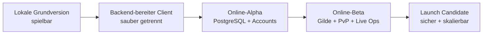

# Idle Tamer – Produkt- und Backend-Roadmap

Stand: 20. Juli 2026

## Zielbild

Idle Tamer wird in vier überprüfbaren Stufen gebaut:



Die Reihenfolge ist absichtlich streng. Zuerst werden Spielregeln und Oberflächen abgenommen. Danach wird jede wertverändernde Aktion serverautoritativ. Gemeinsame Systeme wie Gilde, PvP und Handel starten erst, wenn Besitz, Zeit und Transaktionen zuverlässig auf dem Server liegen.

## Schnellübersicht

| Phase | Ergebnis | Status |
| --- | --- | --- |
| 0 | Testbare lokale Grundversion mit vollständigem Solo-Kernloop | **Fertig** |
| 1 | Polierter, backend-bereiter Client und verbindliche Spielregeln | Als Nächstes |
| 2 | Technisches Backend-Fundament mit PostgreSQL und Accounts | Geplant |
| 3 | Alle Solo-Systeme serverautoritativ | Geplant |
| 4 | Betriebsfähige Online-Alpha mit Admin- und Live-Content-Werkzeugen | Geplant |
| 5 | Gilden, Gilden-DNA und kooperative Inhalte | Geplant |
| 6 | PvP, Ranglisten und soziale Funktionen | Geplant |
| 7 | Handel, Saisons, Live-Events und Launch-Härtung | Geplant |

## Phase 0 – Lokale Grundversion

**Ziel:** Ein kleines Spiel, dessen kompletter Solo-Kern ohne Backend verstanden, gespielt und getestet werden kann.

### Fertig

- [x] Login-Vorschau, Offline-Bericht und Starterwahl
- [x] automatischer 1-gegen-1-Kampf in Normalgeschwindigkeit
- [x] zehn Rookie-Linien mit erster Evolution
- [x] 30 Gegner, fünf Bosse und drei Zonen
- [x] Front-/Supportwahl und zonenspezifische Synergien
- [x] Gold, Run-Level, Stages und Kampfspeicher
- [x] Eierdrops, Pity, Brutzeiten, Erstfund und Duplikat-Fragmente
- [x] Hyperlevel, Evolution, Forschung und Prestige
- [x] drei Gem-Formen, fünf Farben, drei Seltenheiten und 45 Assets
- [x] Tages-/Wochenziele, Erfolge, Story und Systempost
- [x] zwei Zeit-Expeditionsslots und Etherstaub-Herstellung
- [x] Avatare, wechselbare Rahmen und Komforteinstellungen
- [x] Save-Migrationen, Offline-Grenze und Schutz gegen Doppelclaims
- [x] Desktop- und Mobiloberfläche im Silber-Violett-Stil
- [x] automatisierte Regel-, Wirtschafts- und Migrationstests

**Abnahme:** Der aktuelle Stand erfüllt dieses Gate. Details und Testkriterien stehen in `PRE_BACKEND_ROADMAP.md`.

## Phase 1 – Backend-bereiter Client

**Ziel:** Keine neue Großfunktion mehr in den lokalen Save einbauen. Stattdessen den vorhandenen Kern so festziehen, dass das Backend nicht gegen bewegliche Regeln entwickelt wird.

### 1.1 Gameplay-Abnahme

- [ ] erste Spielstunde manuell von neuem Account bis Prestige prüfen
- [ ] Fortschrittskurven für Stunde 1, Tag 1 und Woche 1 festlegen
- [ ] Kostenkurven für Run-Level, Hyperlevel, Evolution und Forschung abnehmen
- [ ] Dropchancen, Ei-Pity, Brutzeiten und Fragmentmengen verbindlich markieren
- [ ] alle Resetgrenzen in einer einzigen getesteten Regeltabelle abbilden
- [ ] leere, volle, gesperrte und maximale Zustände jeder Szene prüfen

### 1.2 UI-, Asset- und Gerätepolitur

- [ ] Kampf-HUD auf Desktop, 390×844 und Tablet vollständig abnehmen
- [ ] Fokusführung, Tastaturbedienung, Kontrast und reduzierte Bewegung prüfen
- [ ] einheitliche Lade-, Fehler-, Verbindungs- und Konfliktzustände gestalten
- [ ] fehlende Audio-/Effektplätze als optionale Asset-Slots definieren
- [ ] PixelLab-Animationsvertrag für 200×200-Monster festlegen
- [ ] Asset-Manifest mit ID, Version, Abmessung und Dateigröße automatisch validieren

### 1.3 Technische Trennung

- [ ] reine Spielregeln von Browser, DOM und `localStorage` entkoppeln
- [ ] Content-Definitionen, API-Verträge und UI in getrennte Pakete überführen
- [ ] `LocalGameService` und späteren `HttpGameService` gegen dieselben Vertragstests prüfen
- [ ] alle Kommandos mit `commandId`, `expectedRevision` und Fehlercodes einfrieren
- [ ] Browser-E2E-Test für Login → Offline-Claim → Kampf → Level → Brut → Prestige ergänzen
- [ ] Build-, Test-, Content- und Asset-Prüfung als CI-Pipeline anlegen

### Empfohlene Zielstruktur

```text
apps/
  web/                 Browser-Client
  api/                 HTTP-API und Hintergrund-Jobs
packages/
  game-core/           reine Regeln und Formeln
  contracts/           DTOs, Kommandos und Fehlercodes
  content/             versionierte Monster, Zonen und Balance
  database/            Schema, Migrationen und Abfragen
  test-fixtures/        reproduzierbare Spielstände
docs/                   Produkt-, Technik- und Betriebswissen
```

Diese Umstellung geschieht erst unmittelbar vor Backend-Beginn. Bis dahin bleibt der aktuelle kleine Vite-Aufbau schneller zu bearbeiten.

### Gate: „Backend bereit“

Phase 1 ist abgeschlossen, wenn:

- `pnpm test` und `pnpm build` grün sind,
- der vollständige Kernloop als Browser-E2E-Test läuft,
- kein Spielkommando resultierende Bestände vom Client akzeptiert,
- Content- und Asset-IDs automatisch validiert werden,
- jede lokale Aktion bereits über den späteren API-Vertrag läuft,
- die Balance- und Resetregeln als abgenommen markiert sind.

## Phase 2 – Backend-Fundament

**Ziel:** Ein deploybares, beobachtbares Grundsystem mit PostgreSQL, Accounts und sicherer Sessionverwaltung. Noch keine Gilde und kein PvP.

### 2.1 Projekt- und Laufzeitbasis

- [ ] TypeScript-API als eigene App einrichten
- [ ] PostgreSQL lokal per Container und in einer getrennten Testumgebung bereitstellen
- [ ] versionierte SQL-Migrationen und Seed-Daten einführen
- [ ] Entwicklungs-, Test- und Produktionskonfiguration strikt trennen
- [ ] strukturierte Logs, Request-ID, Healthcheck und Fehlerformat einbauen
- [ ] automatisierte Datenbanktests gegen eine echte PostgreSQL-Instanz ausführen

### 2.2 Accounts und Sicherheit

- [ ] Registrierung, Login, Logout und Session-Widerruf
- [ ] sichere Passwort-Hashes und HTTP-only Session-Cookies
- [ ] E-Mail-Verifikation und Accountwiederherstellung vorbereiten
- [ ] Rate-Limits für Login und schreibende Kommandos
- [ ] Rollen für Spieler, Support, Moderator und Admin
- [ ] Datenschutz: Export, Löschung und Aufbewahrungsregeln konzipieren

### 2.3 Autoritativer Spielstand

- [ ] `GET /api/game/state` als vollständigen Bootstrap implementieren
- [ ] globale Spielstandsrevision und Content-Version mitsenden
- [ ] `POST /api/game/commands` mit typisiertem Kommando-Umschlag implementieren
- [ ] Idempotenz über Spieler-ID plus `commandId`
- [ ] Konflikte über `expectedRevision` erkennbar und im Client lösbar machen
- [ ] Wallet-, Item- und Wirtschafts-Ledger append-only protokollieren
- [ ] Backups, Wiederherstellung und Migrations-Rollback testen

### Gate: „Online-Fundament“

- Ein Account kann erstellt und auf einem zweiten Browser sicher geladen werden.
- Wiederholte Requests zahlen keine Belohnung doppelt aus.
- Negative Bestände sind durch SQL-Regeln unmöglich.
- Serverneustart oder Client-Reload verlieren keinen bestätigten Fortschritt.
- Ein Backup wurde testweise in eine leere Datenbank zurückgespielt.

## Phase 3 – Solo-Systeme ins Backend migrieren

**Ziel:** Der lokale Save ist nicht länger autoritativ. Jede Ressource, jeder Zeitjob und jeder Besitz wird in PostgreSQL geprüft und gespeichert.

Die Migration erfolgt in vertikalen Scheiben. Jede Scheibe enthält Datenbanktabellen, Serverregeln, API-Kommando, UI-Zustände, Ledger und Tests.

### 3.1 Einstieg und Kampfökonomie

- [ ] Profil, Starterwahl und Zonenfortschritt
- [ ] aktive Front, Support und erlaubte Teamkombinationen
- [ ] serverseitiger Kampftick statt frei gemeldeter Siege
- [ ] Kampfspeicher und atomarer Sammel-Claim
- [ ] Gold, Run-Level und Freischaltungen

### 3.2 Eier und Sammlung

- [ ] Eierdrops und Pity serverseitig berechnen
- [ ] Ei-Inventar und Inkubationsjobs
- [ ] Erstschlupf als Monsterfreischaltung
- [ ] Duplikatschlupf als artspezifische Fragmente
- [ ] Beschleunigungsitems mit atomarem Verbrauch

### 3.3 Permanente Monsterentwicklung

- [ ] Hyperlevel und Fragmentkosten
- [ ] Evolution und Evolutionsmaterialien
- [ ] Gem-Inventar, Slots, Ausrüsten und Entfernen
- [ ] Forschungsstufen und permanente Boni
- [ ] Prestige-Ertrag, Kristallladung und vollständiger Run-Reset

### 3.4 Ziele, Zeitjobs und Meta

- [ ] Tages-, Wochen- und Erfolgsfortschritt
- [ ] Zeit-Expeditionen und Monsterbindung
- [ ] Herstellung und garantierte Rezepte
- [ ] Story-, Avatar- und Rahmenfreischaltungen
- [ ] Systempost mit einmaligen Claims
- [ ] Spieler- und Barrierearm-Einstellungen

### 3.5 Offline-Fortschritt

- [ ] serverseitige Zeitstempel statt Clientdauer verwenden
- [ ] achtstündige Grenze und Kampfspeicherkapazität anwenden
- [ ] verwendete Balance-/Content-Version im Ergebnis speichern
- [ ] Offline-Bericht als einmalig claimbaren Reward-Batch erzeugen
- [ ] Uhrmanipulation, Parallel-Tabs und Request-Retries testen

### Gate: „Online-Alpha – Solo vollständig“

- Alle Funktionen aus Phase 0 arbeiten mit `HttpGameService`.
- `localStorage` enthält nur Komfortdaten, niemals Besitz oder Währungen.
- Jeder Wertwechsel ist Transaktion, Ledger-Eintrag und idempotentes Kommando.
- Der komplette E2E-Kernloop funktioniert mit echter API und PostgreSQL.
- Ein absichtlich veralteter Client kann keinen Spielstand überschreiben.

## Phase 4 – Betrieb, Content und Admin

**Ziel:** Neue Inhalte und Supportfälle können sicher gepflegt werden, ohne direkt in der Produktionsdatenbank zu hantieren.

- [ ] geschütztes Admin-Dashboard mit Rollen und Auditlog
- [ ] Spieler suchen, sperren, entsperren und Supportfall dokumentieren
- [ ] ausschließlich begründete, protokollierte Wirtschaftskorrekturen
- [ ] Content-Version entwerfen, validieren, vorschauen und atomar aktivieren
- [ ] Zonen, Gegnerpools, Bossrotationen, Story und Belohnungen versionieren
- [ ] Feature-Flags und gestufte Freischaltung verwenden
- [ ] Metriken für Login, Retention, Prestige, Dropquellen und Wirtschafts-Senken
- [ ] Alarmierung für Fehlerquote, Jobstau und ungewöhnliche Wirtschaftsbewegungen

**Abnahme:** Ein neuer Zonenentwurf kann ohne Codeänderung geprüft werden, wird aber erst nach Freigabe als unveränderliche Content-Version aktiv. Jede Admin-Aktion ist nachvollziehbar.

## Phase 5 – Gilden und kooperatives Spiel

**Ziel:** Der erste echte Mehrspielerblock nutzt die bereits bewährte Transaktions- und Berechtigungsbasis.

### 5.1 Gildenkern

- [ ] Gilde gründen, suchen, beitreten und verlassen
- [ ] Leitung, Offiziere, Mitgliederrollen und Einladungen
- [ ] Mitgliederlimit, Aktivitätsstatus und Beitragsübersicht
- [ ] Gildenaufgaben, Spenden und unveränderliches Gilden-Ledger
- [ ] faire Regeln für Gildenwechsel und Belohnungssperren

### 5.2 Gilden-DNA

- [ ] DNA-Ressource und Einnahmequellen endgültig benennen
- [ ] Chromosomen, DNA-Segmente, Gene, Stufen und Voraussetzungen modellieren
- [ ] Investitionsrechte: Leitung, Offiziere oder Abstimmung
- [ ] passive Boni mit abnehmendem Power-Zuwachs
- [ ] animierte Doppelhelix und sichtbare Freischaltungen
- [ ] Boni bei jedem serverseitigen Kommando aus gültigem DNA-Snapshot ableiten

### 5.3 Kooperation

- [ ] tägliche und wöchentliche Gildenziele
- [ ] Gildenboss mit serverseitigem Schadens- und Belohnungssnapshot
- [ ] gemeinsame Expeditionen
- [ ] Gildenrangliste und saisonale, nicht ausnutzbare Belohnungen

## Phase 6 – PvP und soziale Funktionen

### PvP

- [ ] asynchrones PvP mit eingefrorenen Verteidigungsteams starten
- [ ] serverseitige Kampfsimulation mit reproduzierbarem Seed
- [ ] Match-Historie und nachvollziehbare Ergebnisdetails
- [ ] Ranglisten, Ligen, Saisonreset und Belohnungsclaims
- [ ] Matchmaking-Schutz gegen Farmen und Absprachen

### Soziales

- [ ] Freundesliste, Anfragen, Blockieren und Privatsphäre
- [ ] Gildenchat und optionale Direktnachrichten
- [ ] Meldungen, Wortfilter, Stummschaltung und Moderationswarteschlange
- [ ] serverseitiges Postfach für System- und Spielerereignisse

## Phase 7 – Handel, Live Ops und Launch

### Handel und Markt

- [ ] zuerst exakt festlegen, welche Items handelbar oder gebunden sind
- [ ] Angebote, Reservierung, Ablauf und atomarer Besitzerwechsel
- [ ] Gebühren als Wirtschafts-Senke
- [ ] Preis- und Missbrauchsüberwachung
- [ ] keine Echtgeldfunktion ohne gesonderte rechtliche und technische Planung

### Live Ops

- [ ] Events, Kalender, globale Ziele und Eventshops
- [ ] Saisons mit versionierten Regeln und Archiven
- [ ] In-App-Ankündigungen und gezielte Systempost
- [ ] Belohnungsfreigabe mit Idempotenz und Auditlog

### Launch-Härtung

- [ ] Lasttests für Login, Bootstrap, Claims, Ranglisten und Gildenboss
- [ ] Sicherheitsprüfung für Auth, Sessions, Rechte und Eingabevalidierung
- [ ] Datenbankindizes anhand echter Query-Pläne prüfen
- [ ] Wiederanlauf, Job-Wiederholung und Ausfallübungen testen
- [ ] Monitoring, Alarmierung, Statusseite und Incident-Ablauf
- [ ] Datenschutz-, Nutzungs- und Community-Regeln veröffentlichen
- [ ] geschlossene Alpha → geschlossene Beta → offene Beta als getrennte Gates

## Verbindliche technische Entscheidungen

- **Datenbank:** PostgreSQL für Accounts, Besitz, Zeitjobs, Gilden und Transaktionen.
- **Serverautorität:** Der Browser übermittelt Absichten, niemals resultierende Bestände.
- **Transaktionen:** Jeder wertverändernde Befehl ist atomar und idempotent.
- **Zeit:** Ausschließlich Serverzeit in UTC; Speicherung als `timestamptz`.
- **Große Zahlen:** SQL `numeric`, Transport als String, keine Gleitkomma-Währungen.
- **Content:** Definitionen bleiben versioniert; SQL speichert IDs und aktive Versionen.
- **Sessions:** Sichere HTTP-only Cookies statt Besitz-Tokens in `localStorage`.
- **Audit:** Kritische Wirtschafts-, Gilden- und Admin-Aktionen erhalten ein Ledger.

## Was bewusst nicht vorgezogen wird

- keine lokal vorgetäuschten Gilden, Ranglisten oder Spielerchats
- kein Handel, bevor Besitz und Ledger serverautoritativ sind
- kein sekündliches Speichern des Idle-Kampfs in PostgreSQL
- kein unversioniertes Direkteditieren von Produktions-Content
- keine zufälligen Gem-Einzelinstanzen, solange gleiche Gem-Definitionen identisch sind
- keine zusätzliche Großfunktion zwischen Phase 1 und der Solo-Backendmigration

## Direkt nächster Arbeitsblock

1. Roadmap und aktuellen Prototyp als Git-Ausgangsstand sichern.
2. Phase-1-Abnahmeliste im echten Browser abarbeiten.
3. Kernregeln und Verträge für die spätere Paketstruktur markieren.
4. API- und PostgreSQL-Grundprojekt anlegen.
5. Als erste vertikale Scheibe Account → Bootstrap → Starterwahl vollständig online bringen.

Die detaillierten SQL-Tabellen stehen in `DATABASE_BLUEPRINT.md`, die Servergrenze in `ONLINE_ARCHITECTURE.md`, die Inhaltsveröffentlichung in `CONTENT_PIPELINE.md` und die vollständige lokale Abnahme in `PRE_BACKEND_ROADMAP.md`.
