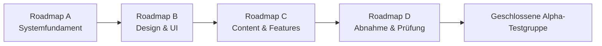

# Entwicklungsprogramm bis zur Alpha und Version 1.0

Idle Tamer World befindet sich noch **vor der Alpha-Testphase**. Vor der ersten externen Alpha-Testgruppe werden vier eigenständige Roadmaps abgeschlossen. Jede Roadmap besitzt ihren eigenen Schwerpunkt und darf die nächste nicht vorwegnehmen.

## Die vier Roadmaps vor der Alpha

| Roadmap | Schwerpunkt | Ergebnis |
| --- | --- | --- |
| **A – Systemfundament** | spielbarer Kern, Accounts, PostgreSQL, Serverautorität, Dauerfortschritt, Gilden und Werkzeuge | technisch belastbare Entwicklungsgrundlage |
| **B – Design und Oberfläche** | gesamtes Interface, UI-System, Lesbarkeit, Navigation, responsive Ansichten, Profile, Avatare, Rahmen und visuelles Feedback | geschlossenes, modernes und verständliches Spielerlebnis |
| **C – Content und Features** | Monster, Gegner, Zonen, Bosse, weitere Spielsysteme, PvP, Handel, Events, Saisons und langfristige Inhalte | inhaltlich vollständiger Alpha-Kandidat |
| **D – Abnahme und Prüfung** | Regression, Balance, Sicherheit, Last, Restore, Barrierefreiheit, Datenschutz, Community-Regeln und Geräteabnahme | freigegebener Alpha-Kandidat |

Die aktuelle Acht-Block-Roadmap ist **Roadmap A**. Ihre Prozentanzeige misst ausschließlich 32 Qualitätsgates dieses Systemfundaments. Sie ist weder der Gesamtfortschritt bis Alpha noch der Gesamtfortschritt bis Version 1.0.

## Alpha erst nach Roadmap D

Vor Abschluss von Roadmap D wird das Spiel nicht als Alpha an eine externe Testgruppe gegeben. Einzelne Entwickler- und QA-Konten auf dem Dev-Server dienen ausschließlich technischen Prüfungen und sind keine Alpha-Testgruppe.

Der bisherige interne Policy-Bezeichner `alpha-foundation-1` bleibt aus Gründen der Daten- und Migrationsstabilität vorerst bestehen. Er ist ein technischer Versionsschlüssel und keine Aussage über den aktuellen Reifegrad. Vor Roadmap D werden die tatsächlich zu veröffentlichenden Nutzungs- und Datenschutzhinweise neu versioniert.

## Reifephasen nach den Roadmaps A bis D

Nach der Abnahme von Roadmap D beginnt die eigentliche Release-Reife:

1. **Alpha** – kleine geschlossene Testgruppe und erste echte Spielerdaten
2. **Beta** – breitere Spielerprüfung und vertiefte Systeme
3. **Gamma** – Skalierung, Langzeitspiel und Produktionshärtung
4. **Beta Release** – öffentlicher Release-Kandidat und wirtschaftliche Abnahme
5. **Launch** – Version 1.0 und regulärer Livebetrieb

Versionsnummern und Termine werden erst vergeben, wenn der Umfang des jeweiligen Abschnitts feststeht. Die Namen beschreiben Reifegrade und sind keine Datumszusage.
