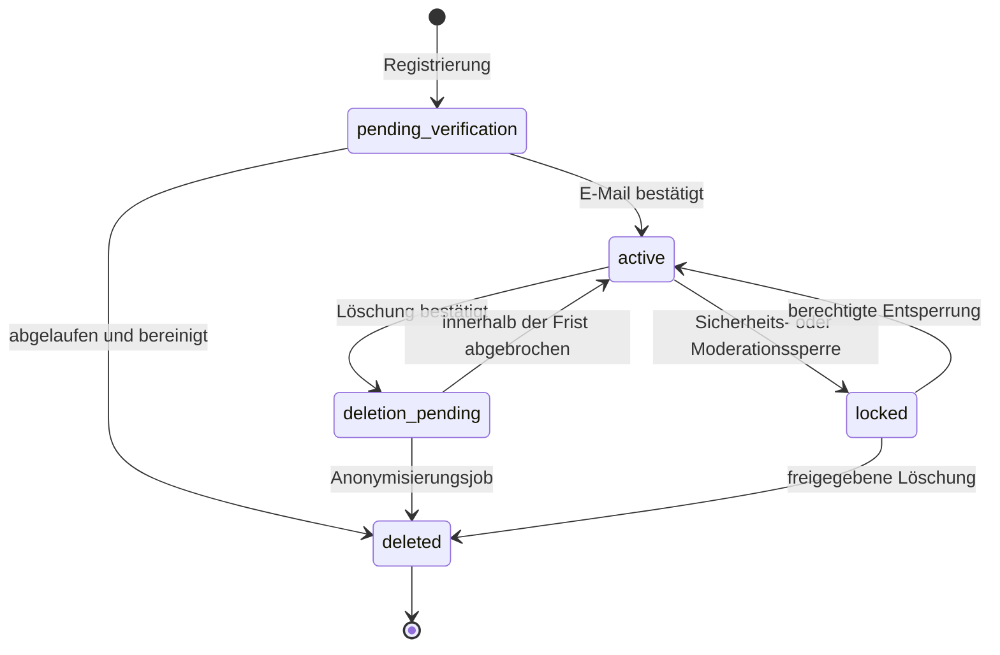

# Block 4, Schritt 1 – Account-, Session- und Bootstrap-Plan

- Status: **verbindlicher Bauvertrag für Block 4, Schritt 2**
- Stand: **21. Juli 2026**
- Auth-Vertrag: **1**
- bestehender Spielvertrag: **API-Protokoll 8 bleibt bis zu seiner späteren Migration unverändert**

## Ergebnis dieses Blocks

Ein Spieler kann ein echtes Konto registrieren, seine E-Mail bestätigen, sich anmelden, aktive Geräte verwalten und auf einem zweiten Browser dasselbe Accountprofil samt gewähltem Starter sehen. Passwortwiederherstellung, Export und Löschanforderung besitzen definierte sichere Abläufe.

Block 4 synchronisiert noch nicht den gesamten Spielstand. Das wäre eine gefährliche Scheinmigration, weil Run, Beute, Sammlung und Zeitjobs erst in Block 5 und 6 serverautoritativ werden.

## Eindeutige Autoritätsgrenze

| Bereich | Block-4-Autorität | Erläuterung |
| --- | --- | --- |
| Benutzer-ID, E-Mailstatus, Accountstatus | Server | PostgreSQL ist einzige Wahrheit |
| Rollen und Policy-Zustimmung | Server | nie aus dem Cookie oder Browser übernehmen |
| Anzeigename, Avatar und Rahmen | Server | auf jedem Gerät identisch |
| gewählter Anfangsstarter | Server | genau einmal und idempotent |
| aktive Sessions und Geräte | Server | einzeln oder vollständig widerrufbar |
| Run, Gold, Zonen, Kampfspeicher | lokal | Migration folgt in Block 5 |
| Eier, Monsterinstanzen, Fragmente, Gems | lokal | Migration folgt in Block 6 |
| Brut, Expeditionen, Forschung, Prestige | lokal | Migration folgt in Block 6 |
| Gilden, Freunde, Chat, PvP, Handel | nicht aktiv | spätere Roadmap-Blöcke |

Der Client zeigt deshalb während Block 4 **„Account online · Spielstand lokal“**. Ein lokaler Save wird mit der serverseitigen `playerId` gebunden und unter einem spielerspezifischen Schlüssel gespeichert. Beim Accountwechsel darf niemals der lokale Save eines anderen Accounts geöffnet oder überschrieben werden.

## Kein halber Game-Bootstrap

Block 4 führt `GET /api/v1/bootstrap` als Account-Bootstrap ein. Der bestehende, noch nicht öffentlich aktivierte Vollspielvertrag `GET /api/game/state` bleibt bis zur serverautoritativen Run-Migration unberührt.

Das verhindert zwei Fehler:

1. Der Server behauptet nicht, lokale Gold-, Run- oder Inventarwerte seien autoritativ.
2. `GameState` wird nicht vorübergehend als großer JSONB-Snapshot gespeichert, nur um ihn später wieder in normale Tabellen zu zerlegen.

Der Account-Bootstrap nennt seine Autoritätsbereiche maschinenlesbar. Block 5 kann dieselbe Bootstrap-Idee um Run und Wirtschaft erweitern; Block 6 ergänzt Sammlung und Zeitjobs.

## Accountzustände

| Status | Anmeldung | Spielzugang | Erlaubte Aktionen |
| --- | --- | --- | --- |
| `pending_verification` | nein | nein | Verifikation erneut senden |
| `active` | ja | gemäß Autoritätsmatrix | normaler Accountbetrieb |
| `locked` | nein | nein | Supportkontakt und Recovery nach Freigabe |
| `deletion_pending` | eingeschränkt | nein | Löschung abbrechen oder Exportstatus lesen |
| `deleted` | nein | nein | kein Zugriff |

`locked` ist ein administrativer Sicherheitsstatus. Fehlgeschlagene Logins setzen keinen dauerhaften Lock, weil ein Angreifer sonst fremde Accounts sperren könnte. Automatische Drosselung läuft getrennt über Rate-Limits.

## Registrierung und E-Mailbestätigung

1. Der Browser lädt eine anonyme CSRF-/Origin-fähige Registrierungsseite.
2. `POST /api/v1/auth/register` erhält E-Mail, Passwort, Anzeigename und Policy-Versionen.
3. E-Mail und Anzeigename werden normalisiert und auf Eindeutigkeit geprüft.
4. Passwort wird mit Argon2id gehasht; Rohwert verlässt den Requestspeicher nicht und erscheint nie im Log.
5. Account, reserviertes Profil, Rollenbasis, Policy-Zustimmungen und gehashter Verifikationstoken entstehen in einer Transaktion.
6. Die API antwortet immer generisch mit `202`, auch wenn die E-Mail bereits existiert. Dadurch wird keine Accountliste preisgegeben.
7. Der Mailadapter sendet einen Link, dessen Token im URL-Fragment liegt. Die Zielseite übermittelt ihn anschließend per JSON-POST, damit Token nicht in Proxy- oder Referrer-Logs landet.
8. Der Token ist zufällig, einmalig, nur gehasht gespeichert und 24 Stunden gültig.
9. Nach erfolgreicher Bestätigung wird der Account `active`; der Spieler meldet sich anschließend normal an.

Die anfängliche Starterauswahl bleibt bei den zehn ursprünglichen Rookie-Linien. Die bestätigten zusätzlichen 30 Sammellinien werden später über Eier und Weltfortschritt eingebunden, nicht als Registrierungsoption vorgetäuscht.

## Passwortregeln

- mindestens 15 und höchstens 128 Unicode-Zeichen
- Leerzeichen und Passwortmanager-Passphrasen sind erlaubt
- keine erzwungene Mischung aus Großbuchstaben, Zahlen und Sonderzeichen
- kein regelmäßiger Zwangswechsel; Wechsel nur bei Nutzerwunsch oder Kompromittierungsverdacht
- Prüfung gegen eine lokal versionierte Liste sehr häufiger oder kompromittierter Passwörter
- keine stillschweigende Kürzung
- identische NFC-Normalisierung bei Setzen und Prüfen
- Argon2id mit `m=65536 KiB`, `t=3`, `p=1`; im echten Container auf 200 bis 500 ms Zielzeit benchmarken
- der PHC-String enthält Algorithmus, Parameter und Salt; bei erfolgreichem Login wird ein veralteter Work-Factor transparent neu gehasht
- im internen Entwicklungsbetrieb kein zusätzlicher Pepper: Vor der Alpha-Freigabe in Roadmap D wird ein Secrets-Manager- und Rotationskonzept separat abgenommen

Diese Parameter liegen oberhalb des derzeitigen OWASP-Mindestprofils. Sollte der Dev-Server das Latenzziel nicht halten, darf nur auf ein anderes von OWASP genanntes Argon2id-Profil gewechselt werden; Argon2id selbst bleibt verbindlich.

## Login und Sessions

1. `POST /api/v1/auth/login` antwortet bei falscher E-Mail oder falschem Passwort mit derselben Meldung und vergleichbarer Laufzeit.
2. Nach erfolgreicher Prüfung entsteht ein kryptografisch zufälliger 256-Bit-Sessiontoken.
3. Nur `SHA-256(token)` wird in PostgreSQL gespeichert.
4. Der Browser erhält `__Host-idle_tamer_session` mit `Secure`, `HttpOnly`, `SameSite=Strict`, `Path=/` und ohne `Domain`.
5. Session- und CSRF-Token werden bei Login, Passwortwechsel und sicherheitsrelevanter Statusänderung rotiert.
6. Pro Account sind höchstens zehn aktive Sessions erlaubt; eine elfte widerruft die älteste inaktive Session.

| Modus | Inaktivitätsgrenze | absolute Grenze |
| --- | ---: | ---: |
| normale Anmeldung | 24 Stunden | 7 Tage |
| „Angemeldet bleiben“ | 14 Tage | 90 Tage |

Aktivität darf nur die Inaktivitätsgrenze innerhalb der absoluten Grenze verschieben. Für Passwortwechsel, E-Mailänderung, Export, Löschung, spätere Handels- und Adminaktionen ist eine höchstens 15 Minuten alte Reauthentifizierung erforderlich.

## Geräteverwaltung

`GET /api/v1/auth/sessions` zeigt Session-ID, automatisch erzeugte Gerätebezeichnung, Erstellzeit, letzte Aktivität, Ablauf und Kennzeichen „dieses Gerät“. Token, Hash, vollständiger User-Agent und rohe IP-Adresse werden nie ausgegeben.

- einzelne fremde Session: `DELETE /api/v1/auth/sessions/:sessionId`
- alle anderen Sessions: `POST /api/v1/auth/logout-others`
- aktuelle Session: `POST /api/v1/auth/logout`
- Passwortreset: widerruft automatisch alle Sessions
- Passwortwechsel: widerruft alle anderen Sessions und rotiert die aktuelle

Gerätebezeichnungen dürfen später vom Spieler angepasst werden. Vorerst werden nur Browserfamilie und Betriebssystem grob zusammengefasst. Rohe IP-Adressen werden nicht dauerhaft im Sessiondatensatz gespeichert.

## CSRF, Origin und CORS

- CORS akzeptiert in Produktion ausschließlich die konfigurierte Spielorigin; keine Wildcards mit Credentials.
- Jeder mutierende Request prüft `Origin` gegen die exakte Allowlist.
- Angemeldete Mutationen benötigen zusätzlich `X-CSRF-Token`.
- Der zufällige CSRF-Token ist an die Session gebunden, wird nur gehasht gespeichert und im Bootstrap geliefert.
- Auth-Cookie und CSRF-Token rotieren gemeinsam.
- Login und Registrierung besitzen noch keine Session und verwenden deshalb exakte Originprüfung, JSON-Content-Type und enge Rate-Limits.
- Zustandsänderungen laufen nie über `GET`.

`SameSite=Strict` ist eine zusätzliche Schutzschicht, ersetzt aber die Origin- und CSRF-Prüfung nicht.

## Rate-Limits und Enumeration-Schutz

Kritische Auth-Limits werden PostgreSQL-gestützt und damit instanzübergreifend gezählt. Der Schlüssel wird als HMAC aus Aktion, normalisierter Identität und Netzwerkpräfix gespeichert; E-Mail oder IP erscheinen nicht im Klartext in der Limit-Tabelle.

| Aktion | Grenze |
| --- | --- |
| Registrierung | 5 pro Stunde je Netzwerk, 3 pro Stunde je E-Mail-Schlüssel |
| Login | 10 pro 15 Minuten je E-Mail-/Netzwerkkombination, 50 je Netzwerk |
| Verifikation erneut senden | 5 pro Stunde je Account, 20 je Netzwerk |
| Passwort vergessen | 3 pro Stunde je Identität, 10 je Netzwerk |
| Resettoken prüfen | 5 Fehlversuche je Token |
| normale authentifizierte API | 120 Requests pro Minute je Session |
| Accountkommandos | 30 pro Minute je Spieler |

Loginversuche erhalten nach wiederholtem Fehlschlag eine progressive serverseitige Verzögerung von 250 bis 1500 ms. Registrierung, Verifikation und Recovery antworten identisch für existierende und nicht existierende E-Mails. HTTP 429 enthält `Retry-After`, aber keine internen Zähler.

## Passwortwiederherstellung

1. `POST /api/v1/auth/password/forgot` antwortet immer `202` mit demselben Text.
2. Ein gültiger Account erhält einen zufälligen 256-Bit-Token mit 30 Minuten Laufzeit.
3. Nur sein SHA-256-Hash wird gespeichert; ein neuer Token invalidiert frühere ungenutzte Resettokens.
4. Der Fragment-Link öffnet die Resetseite, die den Token per POST übermittelt.
5. Neues Passwort und Bestätigung müssen dieselbe Passwortpolicy erfüllen.
6. Nach Erfolg werden alle Sessions widerrufen und eine Sicherheitsnachricht versandt.
7. Der Benutzer wird nicht automatisch eingeloggt.

Sicherheitsfragen und per E-Mail versandte Klartextpasswörter sind ausgeschlossen.

## Anzeigename, Avatar und Rahmen

- Anzeigename: 3 bis 20 sichtbare Grapheme
- erlaubt: Unicode-Buchstaben, Zahlen, einzelne Leerzeichen, `_` und `-`
- NFC-Normalisierung, äußere Leerzeichen entfernen, innere Leerzeichen zusammenfassen
- Vergleich über serverseitig erzeugten, Unicode-fallgefalteten Normalwert
- Steuerzeichen, Bidi-Steuerzeichen und unsichtbare Trennzeichen ablehnen
- Eindeutigkeit wird in PostgreSQL erzwungen
- Änderung höchstens alle 30 Tage; frühere normalisierte Namen bleiben 90 Tage reserviert
- Avatar und Rahmen müssen als freigeschaltete Content-IDs existieren
- Standard: `wanderer` und `silver`; zusätzlich sind `keeper` und `violet` von Beginn an freigeschaltet

Rollen sind `player`, `support`, `moderator`, `admin`. Sie stehen in einer eigenen Zuordnungstabelle und niemals im Cookie. Support darf Account- und Sessionstatus lesen, aber keine Spielwerte verändern. Moderator und Admin erhalten vor echten Werkzeugen eine gesonderte MFA-Pflicht.

## Export und Löschung

### Export

- erfordert aktive Session und frische Reauthentifizierung
- `POST /api/v1/account/export` erstellt einen asynchronen, idempotenten Exportjob
- Ergebnis ist UTF-8-JSON in einem ZIP, 24 Stunden abrufbar
- enthalten: Account- und Profildaten, Policy-Zustimmungen, Sitzungsmetadaten, Starterwahl und später alle Spiel-, Gilden- und Transaktionsdaten des Spielers
- ausgeschlossen: Passwort- und Tokenhashes, interne Geheimnisse, Daten anderer Spieler und nicht freizugebende Moderationsdetails
- jeder Abruf wird als Security Event protokolliert

### Löschung

- erfordert frische Reauthentifizierung und eine ausdrückliche zweite Bestätigung
- Account wechselt für sieben Tage zu `deletion_pending`; Spielzugang wird gesperrt und alle Sessions werden widerrufen
- innerhalb der Frist kann der Spieler sich eingeschränkt anmelden und die Löschung abbrechen
- danach entfernt ein idempotenter Job Credentials, Sessions, Tokens, Exportdateien und personenbezogene Profildaten
- E-Mailfelder werden auf `NULL` gesetzt, der Anzeigename wird anonymisiert und wieder freigegeben
- wirtschaftliche Ledgerzeilen dürfen nur anonymisiert und entsprechend einer später festgelegten gesetzlichen Aufbewahrung bestehen bleiben
- Backups laufen regulär aus; ein Restore muss nachgelagerte Löschereignisse erneut anwenden

Die Sieben-Tage-Frist ist eine Produktoberfläche, keine Behauptung, gesetzliche Rechte einzuschränken. Vor der Alpha-Freigabe nach Roadmap D werden Rechtsgrundlage, Altersmodell, Aufbewahrungsplan und Pflichttexte fachjuristisch geprüft. Die spätere geschlossene Alpha ist zunächst auf Testpersonen ab 16 Jahren beschränkt und enthält keine Echtgeldfunktion.

## Mail- und Secret-Grenze

- `MailDeliveryPort` trennt Authlogik vom Anbieter.
- Tests verwenden einen reinen In-Memory-Adapter.
- Dev-Server verwendet einen internen Test-Mailcatcher; Tokens erscheinen nicht in API-Logs oder öffentlichen Antworten.
- Produktion erhält einen separaten SMTP-/Transaktionsmail-Anbieter und DKIM/SPF/DMARC-Prüfung.
- `RATE_LIMIT_HMAC_SECRET` und Mailzugänge liegen nur in Secret-Konfiguration, nie im Repository.
- Die 256-Bit-Sessiontokens benötigen neben ihrem gespeicherten SHA-256-Hash keinen zusätzlichen Pepper. Rate-Limit-HMAC-Schlüssel werden versioniert rotiert; Sessiontokens werden bei einer sicherheitsrelevanten Rotation separat widerrufen.

## Beobachtbarkeit ohne Datenleck

Security Events protokollieren Ereignistyp, User-ID falls bekannt, Session-ID, Zeitpunkt, Ergebnis und minimierte Metadaten. Nicht gespeichert oder geloggt werden Rohpasswort, Token, Cookie, E-Mail im Klartext, vollständige IP oder vollständiger User-Agent.

Geplante Aufbewahrung für die spätere Alpha:

| Daten | Frist |
| --- | ---: |
| aktive Session | bis Widerruf oder Ablauf |
| widerrufene Sessionmetadaten | 90 Tage |
| verbrauchte/abgelaufene Accounttokens | 7 Tage |
| Auth-Rate-Limit-Fenster | 48 Stunden |
| Security Events | 30 Tage |
| Exportdatei | 24 Stunden |
| lokale Dev-Backups | 14 Tage gemäß Betriebsplan |

## Verbindliche Bau-Reihenfolge

1. Migration `000002_accounts_and_sessions` mit Constraints und Indizes
2. Konfigurations- und Secretvertrag
3. Passwort-, Token-, Session-, CSRF- und Rate-Limit-Dienste
4. Mailport und Testadapter
5. Registrierung, Verifikation, Login, Logout und Bootstrap
6. Geräteverwaltung und Passwortreset
7. Profil und idempotente Starterwahl
8. Export- und Löschjobs
9. Account-Client und sichtbare Autoritätsanzeige im Browser
10. Integrations-, Browser-, Missbrauchs- und Deploymenttests

Die exakten HTTP-Felder stehen in `AUTH_API_CONTRACT.md`, Tabellen und Constraints in `AUTH_SCHEMA_PLAN.md`.

## Gate für Schritt 2

- [x] Accountzustände und Übergänge sind eindeutig.
- [x] Passwortalgorithmus und Parameter sind festgelegt.
- [x] Sessiondauer, Cookieattribute, Rotation und Widerruf sind festgelegt.
- [x] CSRF-, CORS-, Rate-Limit- und Enumeration-Schutz besitzen konkrete Regeln.
- [x] Recovery-, Export- und Löschablauf sind beschrieben.
- [x] Profil, Rollen, Starterwahl und Autoritätsgrenze sind beschrieben.
- [x] SQL- und HTTP-Verträge besitzen eine baubare Zielstruktur.
- [x] Abnahmekriterien decken zweite Browser, Parallelität und Missbrauch ab.

## Offizielle Sicherheitsgrundlagen

- OWASP Password Storage Cheat Sheet: https://cheatsheetseries.owasp.org/cheatsheets/Password_Storage_Cheat_Sheet.html
- OWASP Session Management Cheat Sheet: https://cheatsheetseries.owasp.org/cheatsheets/Session_Management_Cheat_Sheet.html
- OWASP Forgot Password Cheat Sheet: https://cheatsheetseries.owasp.org/cheatsheets/Forgot_Password_Cheat_Sheet.html
- NIST SP 800-63B-4: https://doi.org/10.6028/NIST.SP.800-63B-4
- Datenschutzrechte der EU-Kommission: https://commission.europa.eu/law/law-topic/data-protection/reform/rights-citizens/how-my-personal-data-protected/how-should-my-consent-be-requested_en
- DSGVO Artikel 17 bis 20: https://eur-lex.europa.eu/eli/reg/2016/679/art_17/oj/eng
