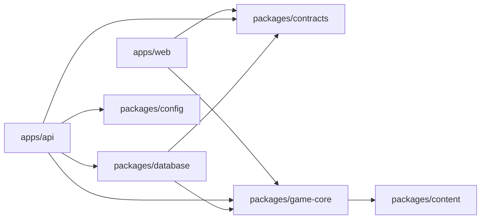

# Backend-Stack und Workspace

- Status: **verbindlich für Block 3**
- Stand: **20. Juli 2026**

## Entscheidung

| Bereich | Entscheidung | Begründung |
|---|---|---|
| Runtime | Node.js 24 LTS | passt zum bestehenden TypeScript-Client und ist die aktuelle LTS-Linie |
| Paketmanager | pnpm 11 Workspaces | bereits im Projekt aktiv; ein Lockfile und eine Qualitätsschranke |
| Sprache | TypeScript, ESM, Strict Mode | Verträge und deterministische Spielregeln können geteilt werden |
| HTTP | Fastify 5 | kleine Pluginstruktur, Schema-Unterstützung, eingebautes Pino-Logging und gute Testbarkeit über `inject` |
| Validierung | Zod 4 | Laufzeitprüfung von Umgebungsvariablen, Kommandos und Datenbank-Mappings |
| Datenbank | PostgreSQL 18 | aktuelle stabile Hauptversion, lange Supportzeit und passende Transaktions-/Constraint-Funktionen |
| SQL-Zugriff | `pg` 8 | parameterisierte Abfragen, Pooling und explizite Transaktionskontrolle ohne ORM-Magie |
| Migration | `node-pg-migrate` 9 | versionierte Up-/Down-Migrationen, TypeScript-Unterstützung und PostgreSQL-Fokus |
| Tests | Vitest + echte PostgreSQL-Testdatenbank | bestehender Runner; Regeln bleiben schnell, SQL wird gegen die echte Engine geprüft |

Paketversionen werden im Bauschritt exakt im Lockfile gesichert. Abhängigkeiten verwenden keine unkontrollierten `latest`-Tags in CI oder Produktion.

## Warum keine ORM?

Idle Tamer braucht weniger Komfort-CRUD als nachvollziehbare Transaktionen. Bestände, Revisionen, Idempotenz, Zeilenlocks, bedingte Updates, partielle Indizes und append-only Ledger sollen als SQL sichtbar bleiben. `pg` hält diese Regeln prüfbar und verhindert, dass kritische Datenbanklogik versehentlich nur in TypeScript existiert.

Repository-Funktionen mappen Datenbankzeilen unmittelbar in validierte Domänenwerte. Große `numeric`-Werte verlassen `pg` als Strings und werden niemals still in JavaScript-`number` umgewandelt.

## Zielstruktur

```text
idle-tamer-world/
├─ apps/
│  ├─ web/                 bestehender Vite-Client
│  └─ api/                 Fastify-Server, Plugins, Routes und Kommandohandler
├─ packages/
│  ├─ contracts/           API-Protokoll 8, Zod-Schemas und DTO-Typen
│  ├─ game-core/           deterministische Regeln ohne DOM oder SQL
│  ├─ content/             Monster, Zonen, Encounter und versionierte Balance
│  ├─ database/            Pool, Migrationen, SQL-Repositories und Transaktionshelfer
│  └─ config/              validierte Umgebung und Log-Redaction
├─ infra/
│  ├─ compose.yaml         lokale PostgreSQL-18-Instanz
│  ├─ postgres/            nur notwendige lokale Initialisierung
│  └─ scripts/             Health-, Backup- und Restore-Einstiegspunkte
├─ docs/
├─ package.json            reine Workspace-Orchestrierung
└─ pnpm-workspace.yaml
```

Ein Worker wird erst ergänzt, wenn Block 6 echte zeitgesteuerte Jobs benötigt. Bis dahin verarbeitet die API fällige Offline-, Brut- und Expeditionszeiten beim autoritativen Request. Redis wird erst eingeführt, wenn gemessene Last einen konkreten Bedarf zeigt.

## Abhängigkeitsrichtung



- `contracts` kennt weder Browser, Fastify noch Datenbank.
- `game-core` kennt keine Uhr, kein `localStorage`, kein HTTP und kein SQL.
- `content` enthält nur veröffentlichte Definitionen samt Release-ID.
- `database` importiert Regeln für atomare Kommandos, aber die Regeln importieren niemals die Datenbank.
- `api` verbindet Transport, Session, Transaktion und autoritative Antwort.

## Umzug ohne Big Bang

Der Bauschritt erfolgt in vier grünen Zwischenständen:

1. Root wird Workspace-Orchestrator; vorhandener Client zieht unverändert nach `apps/web` und alle bisherigen Tests bleiben grün.
2. API-Verträge, Regeln und Content werden paketweise extrahiert; temporäre Re-Exports halten Imports stabil.
3. `apps/api`, `packages/database`, PostgreSQL und Healthcheck kommen hinzu.
4. Erst danach wird ein kleines echtes Kommando an die neue SQL-Schicht angeschlossen.

Es gibt keinen Zwischenstand, in dem der bestehende Browser-Prototyp absichtlich unstartbar ist.

## Start- und Prüfbefehle im Zielzustand

```text
pnpm dev                 Web und API parallel
pnpm db:up               lokale PostgreSQL-Instanz starten
pnpm db:migrate          ausstehende Migrationen anwenden
pnpm db:reset:test       isolierte Testdatenbank neu aufbauen
pnpm test                schnelle Paket- und Regelsuite
pnpm test:integration    echte PostgreSQL-Tests
pnpm check:all           gesamte Workspace-Schranke
```

## Offizielle Grundlage

- Node.js Releaseübersicht: https://nodejs.org/en/about/previous-releases
- Fastify-LTS und v5: https://fastify.dev/docs/latest/Reference/LTS/
- Fastify-Struktur: https://fastify.dev/docs/latest/Guides/Getting-Started/
- PostgreSQL-Versionen: https://www.postgresql.org/support/versioning/
- `pg`-Transaktionen: https://node-postgres.com/features/transactions
- `node-pg-migrate`: https://salsita.github.io/node-pg-migrate/
